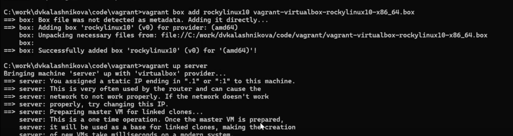
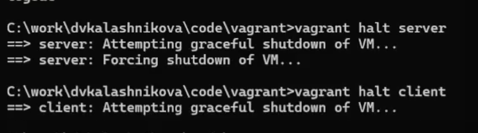
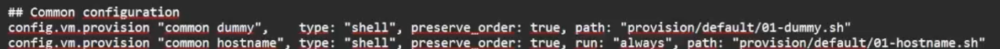

# Цель работы

Целью данной работы является приобретение практических навыков установки Rocky Linux на виртуальную машину с помощью инструмента Vagrant.

# Выполнение лабораторной работы

Для начала создадим папку с инициалами, в которой будет 2 папки, показанные на фото (@fig-001).

{#fig-001}

Теперь инициализируем packer и сделаем билд образа (@fig-002).

{#fig-002}

После этого добавим его в vagrant (@fig-003).

{#fig-003}

Запустим через vagrant ВМ сервера (@fig-004).

{#fig-004}

И запустим еще клиент (@fig-005).

{#fig-005}

Убедимся, что они оба работают, через графический интерфейс. Войдём туда под пользователем vagrant (@fig-006).

{#fig-006}

Теперь попробуем зайти на сервер через ssh, после чего авторизируемся от имени собственного пользователя, и отключимся (@fig-007).

{#fig-007}

Сделаем то же самое для клиента, выключим обе машины (@fig-008).

{#fig-008}

Также убедимся, что у нас всё корректно в файле Vagrantfile (@fig-009).

{#fig-009}

# Выводы

В результате выполнения лабораторной работы были получены навыки работы с vagrant.
