# Информация

## Докладчик

:::::::::::::: {.columns align=center}
::: {.column width="70%"}

  * Калашникова Дарья Викторовна
  * Студент
  * Российский университет дружбы народов
  * [1132243108@pfur.ru](mailto:1132243108@pfur.ru)

:::
::: {.column width="30%"}

:::
::::::::::::::

## Цель работы

Приобретение практических навыков по установке и конфигурированию DNS-сервера, усвоение принципов работы системы доменных имён.

## Запуск ВМ

Для начала запустим виртуальную машину через vagrant.

{#fig:001 width=60%}

## Скачивание пакетов

Теперь скачаем пакет bind utils.

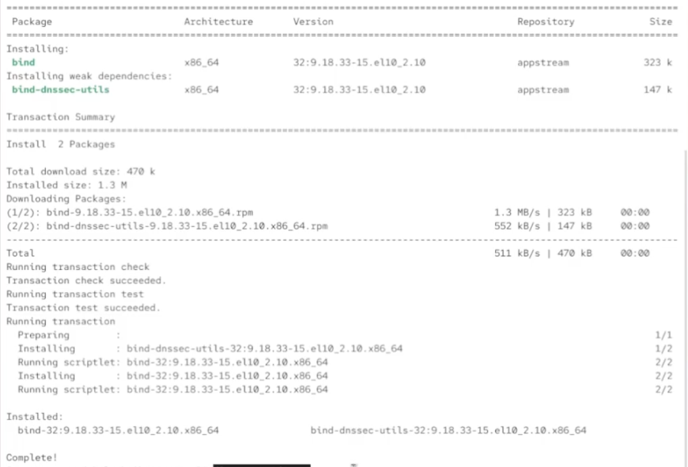{#fig:002 width=60%}

## Проверка dig ya.ru

Используем команду dig для проверки сервисов яндекса.

{#fig:003 width=60%}

## Файлы конфигурации

Посмотрим на содержание файлов конфигурации dns в etc.

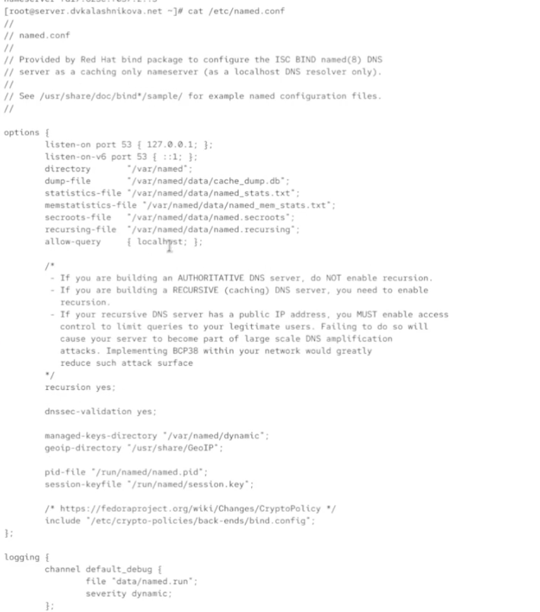{#fig:004 width=30%}

## named.ca

Просмотрим теперь файл named.ca.

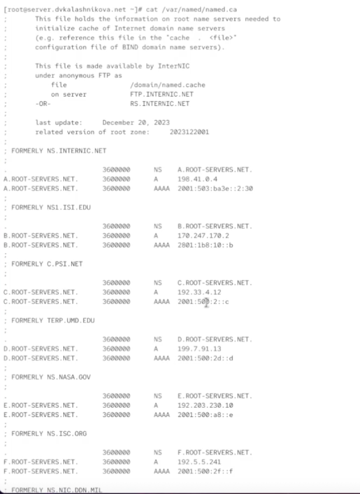{#fig:005 width=30%}

## named.localhost и named.loopback

Содержимое named.localhost и named.loopback.

{#fig:006 width=60%}

## Запуск named

Запустим теперь named и осуществим снова dig yandex.ru.

{#fig:007 width=40%}

## eth0

Теперь настроим порт eth0.

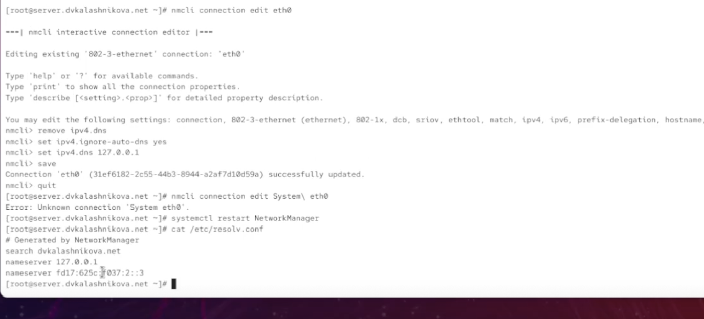{#fig:008 width=60%}

## named.conf

Откроем и отредактируем named.conf.

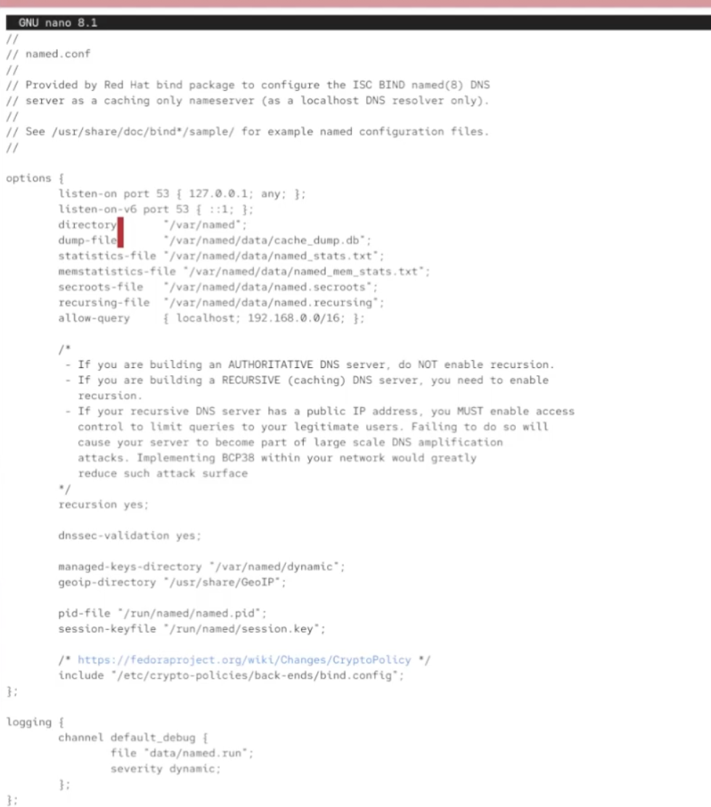{#fig:009 width=30%}

## Правила фаервола

Установим правила фаервола.

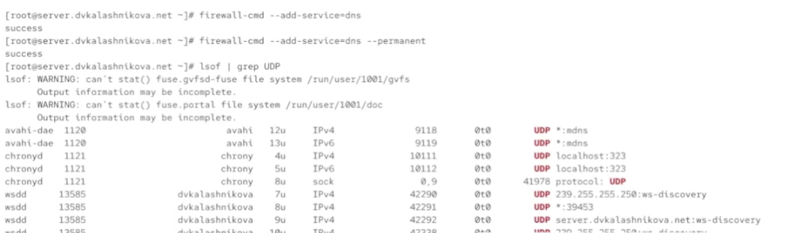{#fig:010 width=60%}

## Перемещение файла

Теперь переместим файл с настройкой конфига.

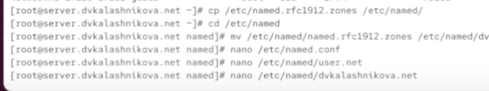{#fig:011 width=60%}

## Редактирование файла

И отредактируем наш файл под наши параметры.

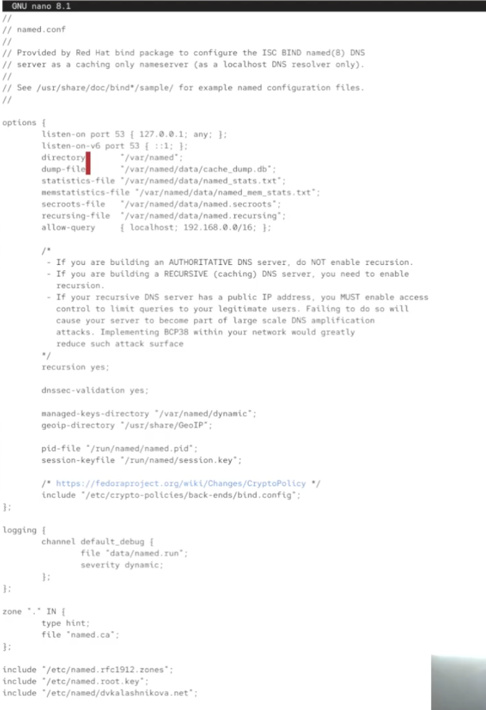{#fig:012 width=30%}

## Файл зон

То же самое сделаем с файлом зон.

{#fig:013 width=40%}

## Создание папок и настроек днс

Создадим папки с настройками днс.

{#fig:014 width=60%}

## nsandryushin.net

Отредактируем файл nsandryushin.net.

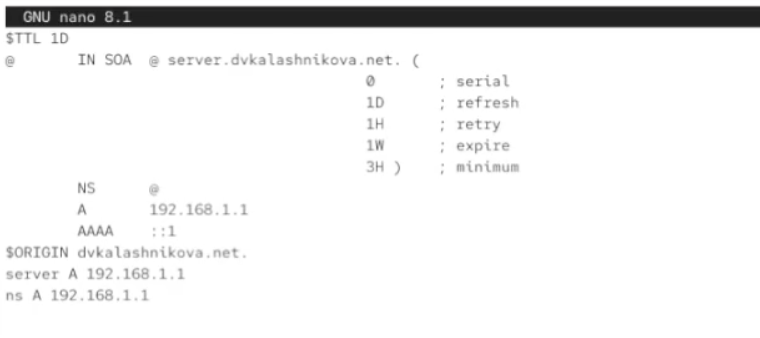{#fig:015 width=60%}

## Папка rz

Теперь посмотрим на файлы из папки rz.

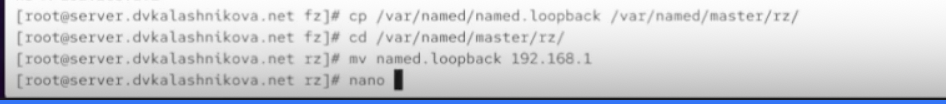{#fig:016 width=60%}

## Редактирование файла

Отредактируем следующим образом.

{#fig:017 width=60%}

## Selinux

Настроим Selinux.

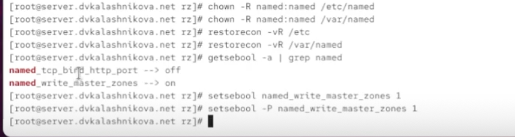{#fig:018 width=60%}

## dig

Через dig попробуем подключиться к собственному днс.

{#fig:019 width=40%}

## Конфиг вагрант

Оформим нашу работу как конфигурацию для вагранта.

{#fig:020 width=60%}

## скрипт

И напишем скрипт для загрузки вагранта.

{#fig:021 width=30%}

## vagrantfile

И в vagrantfile будем загружать этот скрипт.

{#fig:022 width=60%}

## Выводы

В результате выполнения работы были получены навыки настройки днс.
