# Цель работы

Приобретение практических навыков по установке и конфигурированию DNS-сервера, усвоение принципов работы системы доменных имён.

# Выполнение лабораторной работы

Для начала запустим виртуальную машину через vagrant (рис. [-@fig:001]).

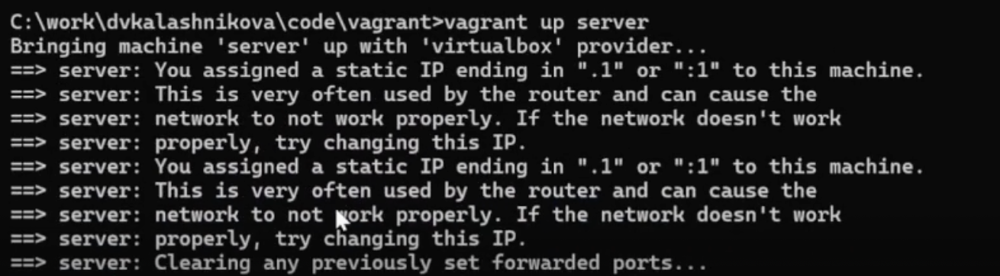{#fig:001}

Теперь скачаем пакет bind utils (рис. [-@fig:002]).

{#fig:002}

Используем команду dig для проверки сервисов яндекса (рис. [-@fig:003]).

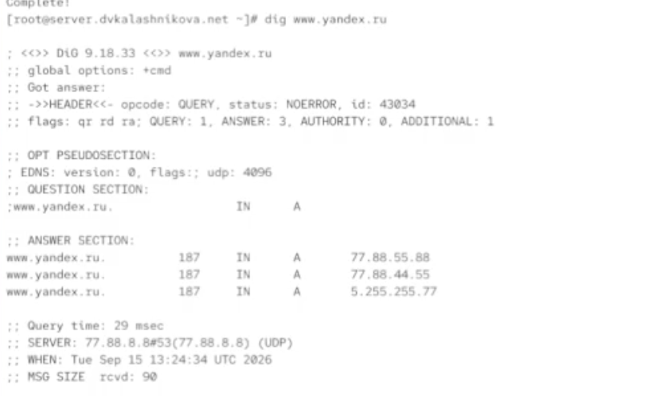{#fig:003}

Посморим на содержание файлов конфигурации dns в etc (рис. [-@fig:004]).

{#fig:004}

Просморим теперь файл named.ca (рис. [-@fig:005]).

{#fig:005}

Содержимое named.localhost и named.loopback (рис. [-@fig:006]).

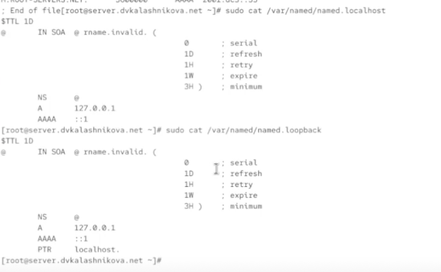{#fig:006}

Запустим теперь named и осуществим снова dig yandex.ru (рис. [-@fig:007]).

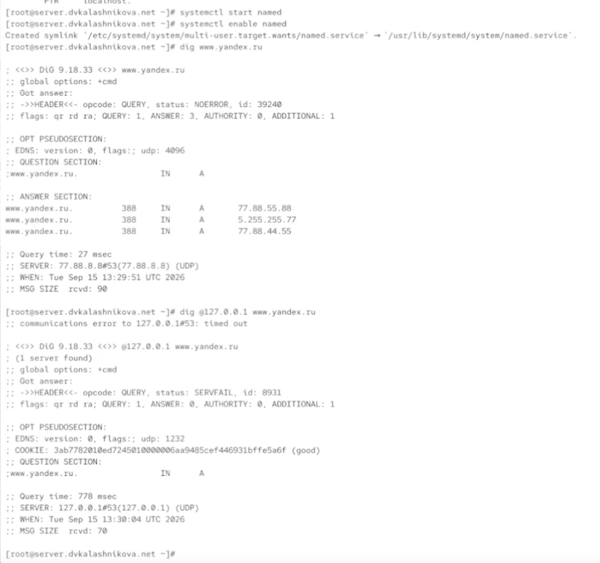{#fig:007}

Теперь настроим порт eth0 (рис. [-@fig:008]).

{#fig:008}

Откроем и отредактируем named.conf (рис. [-@fig:009]).

{#fig:009}

Установим правила фаервола (рис. [-@fig:010]).

{#fig:010}

Теперь переместим файл с настройкой конфига (рис. [-@fig:011]).

{#fig:011}

И отредактируем наш файл под наши параметры (рис. [-@fig:012]).

{#fig:012}

То же самое сделаем с файлом зон (рис. [-@fig:013]).

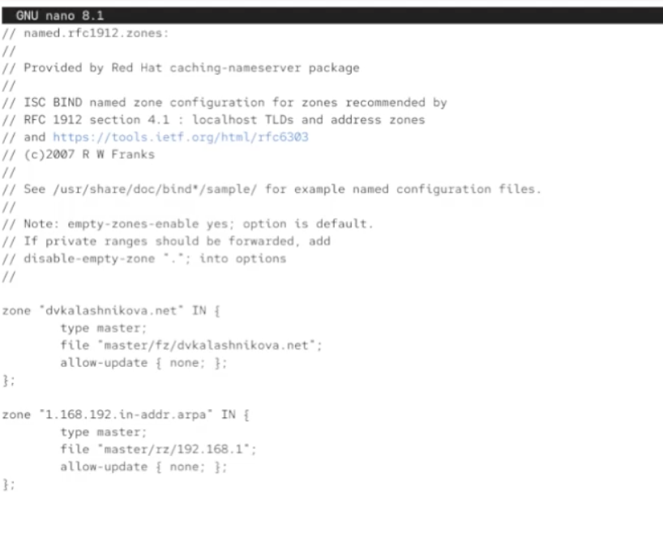{#fig:013}

Создадим папки с настройками днс (рис. [-@fig:014]).

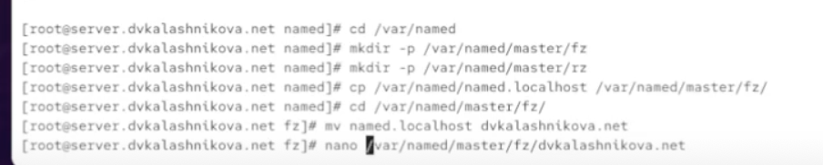{#fig:014}

Отредактируем файл dvkalashnikova.net (рис. [-@fig:015]).

{#fig:015}

Теперь посмотрим на файлы из папки rz (рис. [-@fig:016]).

{#fig:016}

Отредактируем следующим образом (рис. [-@fig:017]).

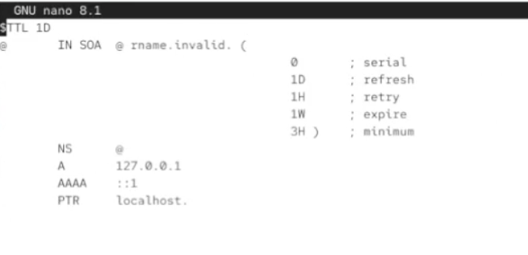{#fig:017}

Настроим Selinux (рис. [-@fig:018]).

{#fig:018}

Через dig попробуем подключиться к собственному днс (рис. [-@fig:019]).

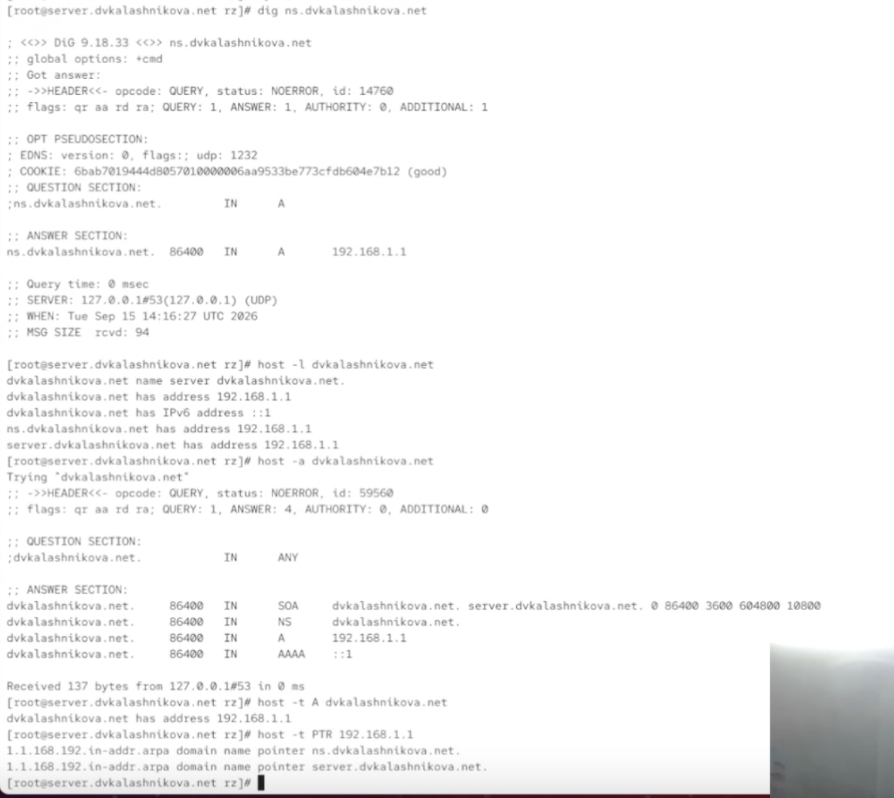{#fig:019}

Оформим нашу работу как конфигурацию для вагранта (рис. [-@fig:020]).

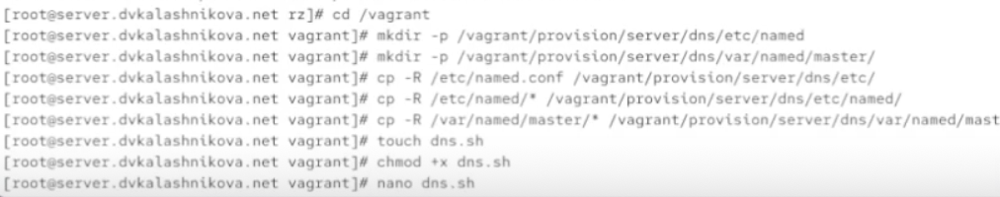{#fig:020}

И напишем скрипт для загрузки вагранта (рис. [-@fig:021]).

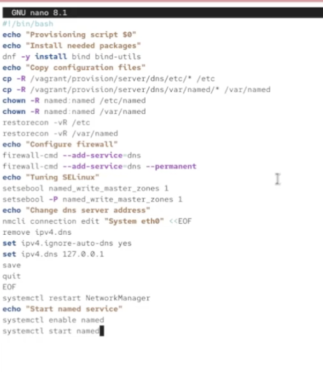{#fig:021}

И в vagrantfile будем загружать этот скрипт (рис. [-@fig:022]).

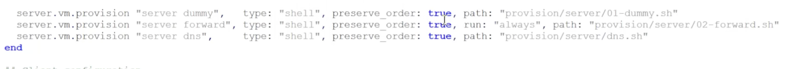{#fig:022}

# Выводы

В результате выполнения работы были получены навыки настройки днс
