# Информация

## Докладчик

:::::::::::::: {.columns align=center}
::: {.column width="70%"}

  * Калашникова Дарья Викторовна
  * Студент
  * Российский университет дружбы народов
  * [1132243108@pfur.ru](mailto:1132243108@pfur.ru)

:::
::: {.column width="30%"}

:::
::::::::::::::

## Цель работы

Приобретение практических навыков по установке и конфигурированию DHCP-сервера.

## Установка kea

Зайдём под рутом и установим пакет для настройки dhcp - kea.

{#fig-001 width=60%}

## Бекап конфига

Перед изменением конфигурационного файла сделаем бекап и отредактируем его.

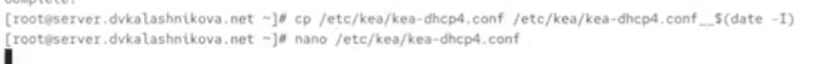{#fig-002 width=60%}

## Редактирование конфига

Меняем изначальные данные на свои — доменное имя и ip нашей машины (192.168.1.1).

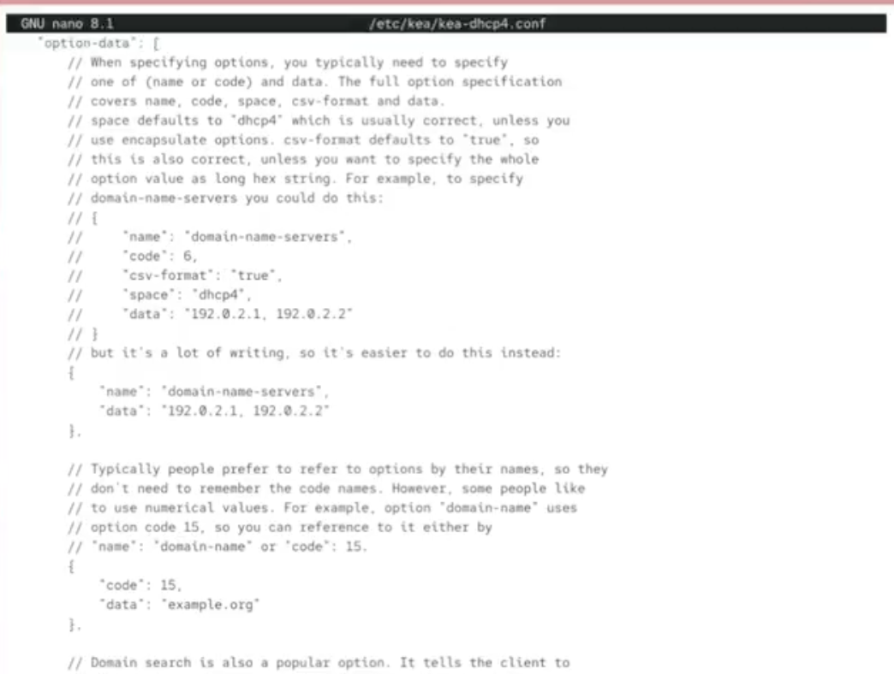{#fig-003 width=60%}

## Настройка подсети

Спустимся ниже и настроим свою подсеть.

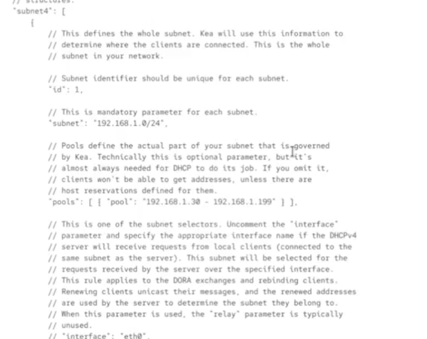{#fig-004 width=60%}

## Установка интерфейса

Установим интерфейс для dhcp как eth1.

{#fig-005 width=60%}

## Загрузка конфига

Загрузим конфиг и убедимся, что нигде нет критических ошибок.

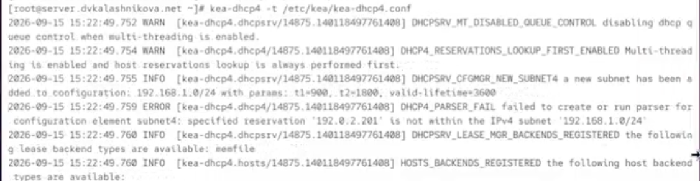{#fig-006 width=60%}

## Перезагрузка демонов

Перезагрузим системные демоны.

{#fig-007 width=60%}

## Редактирование fz

Отредактируем файл с прошлой лабораторной работы в папке fz, добавив запись о dhcp.

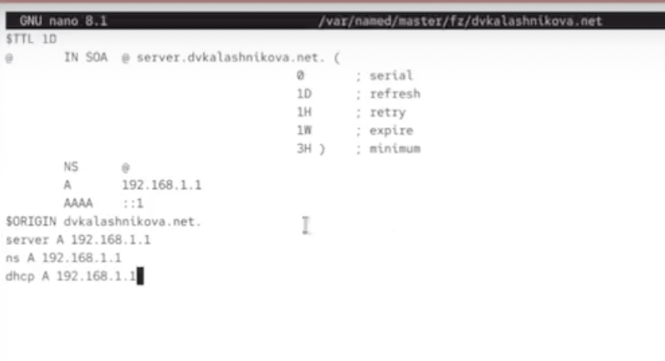{#fig-008 width=60%}

## Редактирование rz

То же самое сделаем с rz.

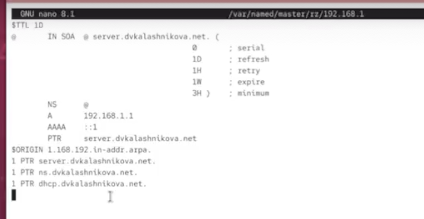{#fig-009 width=60%}

## Пинг dhcp

Перезагрузим сервер ДНС и убедимся, что можем пингануть dhcp сервер.

{#fig-010 width=60%}

## Firewall и selinux

Настроим firewall и обновим метки selinux.

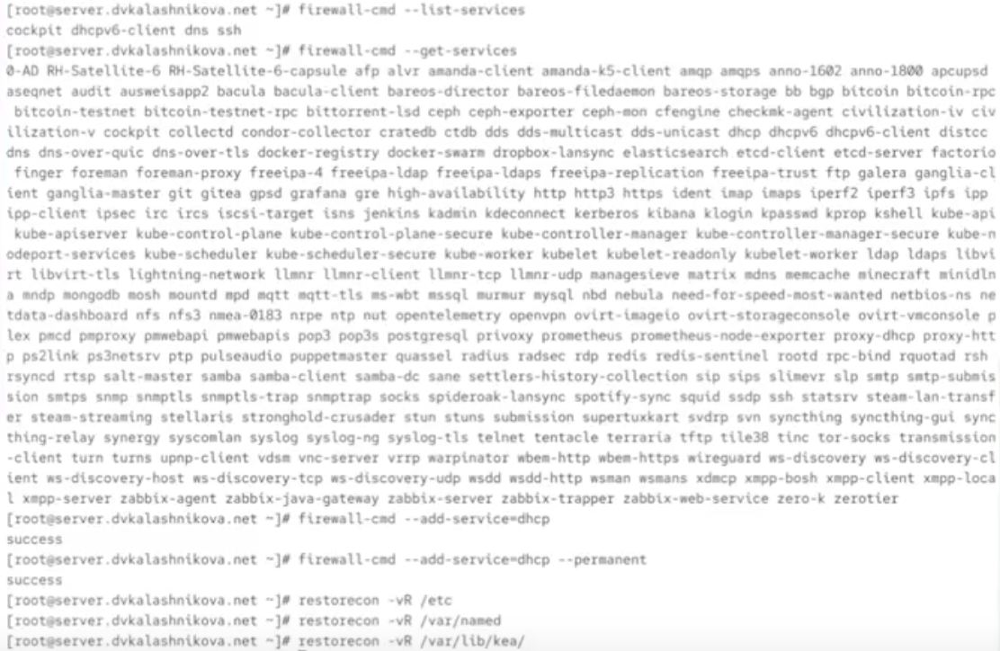{#fig-011 width=60%}

## Логи сервера

Убедимся по логам, что сервер ДНС работает и не выдаёт ошибок.

{#fig-012 width=60%}

## Запуск dhcp

Теперь запускаем dhcp сервер.

{#fig-013 width=60%}

## Скрипт для клиента

Убедимся, что в папке клиента в vagrant представлен скрипт для настройки сети, берущей ip по dhcp.

{#fig-014 width=60%}

## Vagrantfile

В Vagrantfile убедимся, что этот скрипт прописан для запуска.

{#fig-015 width=60%}

## Запуск клиента

Когда приготовления завершены, запускаем клиент.

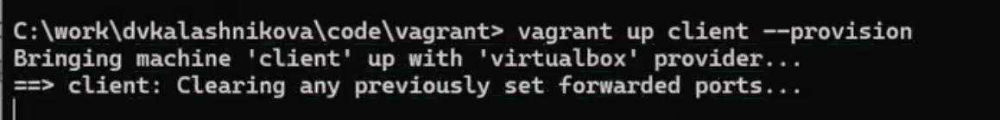{#fig-016 width=60%}

## Проверка IP через ifconfig

Зайдя в клиент, через ifconfig убедимся, что айпи был получен с сервера — 192.168.1.30.

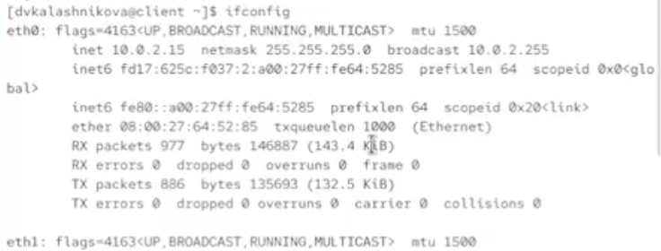{#fig-017 width=60%}

## Таблица назначений

Информация о назначении айпи хранится в файле /var/lib/kea/kea-leases4.csv на сервере.

{#fig-018 width=60%}

## Ключ sha512

Создадим ключ sha512 и убедимся, что он создался.

{#fig-019 width=60%}

## Добавление ключа

Этот ключ добавим в /etc/named.conf.

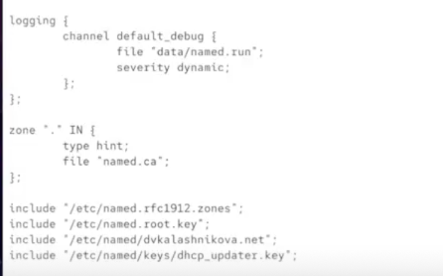{#fig-020 width=60%}

## Обновление файла

Обновим файл /etc/named/nsandryushin.net, добавив туда dhcp.

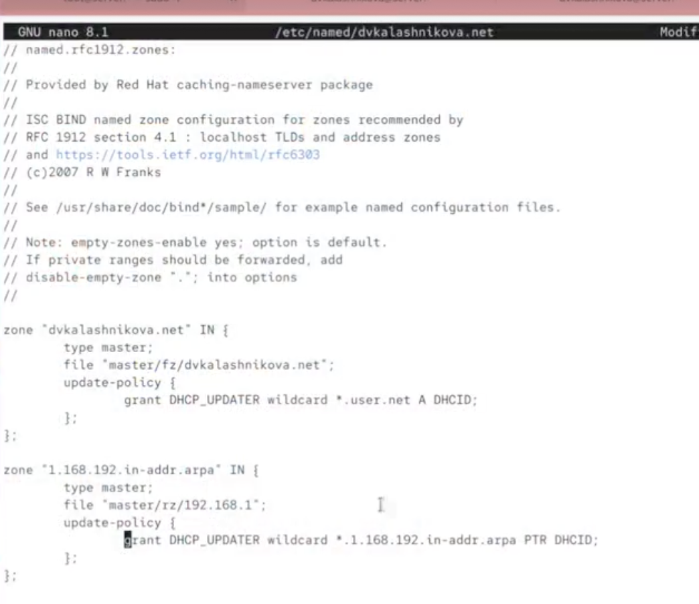{#fig-021 width=60%}

## Применение изменений

Проверим корректность конфига на синтаксис, перезапустим DNS службу, создадим файл с ключом.

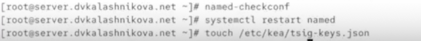{#fig-022 width=60%}

## Вставка ключа

В созданный файл вставим ключ, который мы сгенерировали ранее.

{#fig-023 width=60%}

## Смена прав файла

Поменяем права и владельца созданного файла, предоставив его системному пользователю службы.

{#fig-024 width=60%}

## Изменение конфигурации ddns

Заполним файл конфигурации ddns с нуля согласно шаблону, поменяв имя на свой домен.

{#fig-025 width=60%}

## Перезапуск ddns

Предоставим этот файл во владение системному пользователю, загрузим конфигурацию и перезапустим ddns службу.

{#fig-026 width=60%}

## Добавление информации о ddns

Добавим информацию о ddns в наш файл с конфигурацией dhcp.

{#fig-027 width=60%}

## Перезапуск службы

Вновь загрузим конфигурацию и перезапустим службу dhcp.

{#fig-028 width=60%}

## Обновление данных

Теперь на клиенте перезапустим интернет, чтобы обновить данные.

{#fig-029 width=60%}

## Проверка через dig

Через dig получим информацию о нашем сервере.

{#fig-030 width=60%}

## Перенос конфигурации

Переместим данные созданных ранее конфигураций в vagrant, после чего создадим скрипт.

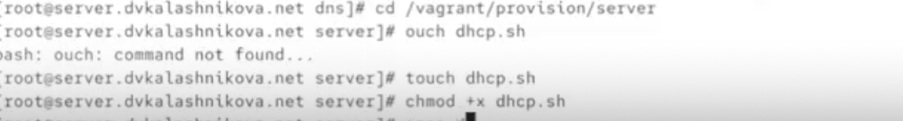{#fig-031 width=60%}

## Скрипт vagrant

В скрипте напишем алгоритм настройки dhcp.

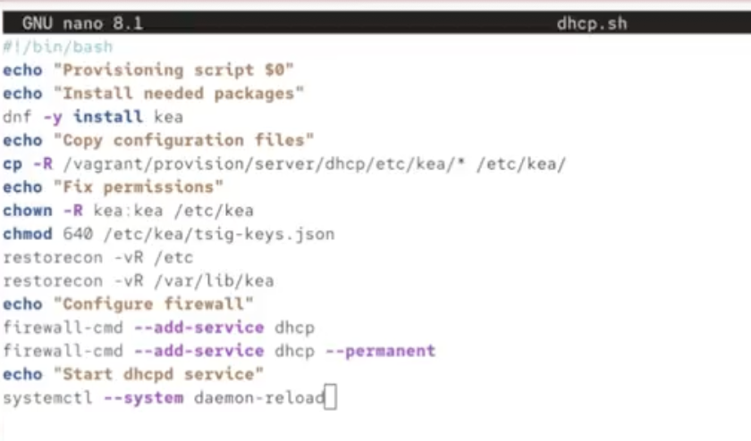{#fig-032 width=60%}

## Выводы

В результате выполнения работы были получены навыки настройки dhcp.
