# Цель работы

Приобретение практических навыков по установке и конфигурированию DHCP-сервера.

# Выполнение лабораторной работы

Зайдём под рутом и установим пакет для настройки dhcp - kea (@fig-001).

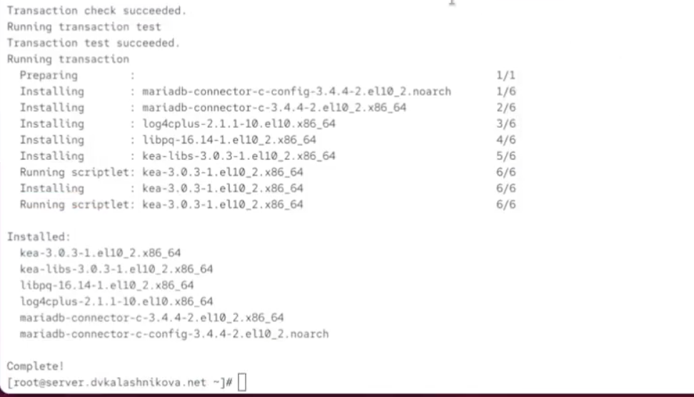{#fig-001 width=70%}

Перед изменением конфигурационного файла, на всякий случай сделаем бекап и отредактируем его (@fig-002).

{#fig-002 width=70%}

Мы поменяем изначальные данные на свои - изменим доменное имя на собственное, а также поставим ip на ip нашей машины - 192.168.1.1 (@fig-003).

{#fig-003 width=70%}

Спустимся ниже и настроим свою подсеть следующим образом (@fig-004).

{#fig-004 width=70%}

И установим интерфейс для dhcp как eth1 (@fig-005).

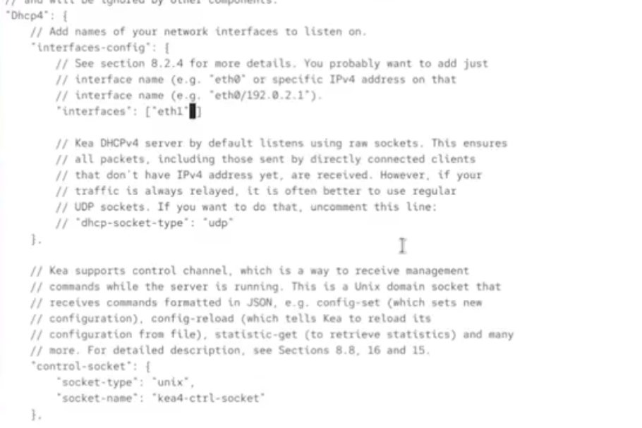{#fig-005 width=70%}

Загрузим конфиг и убедимся, что нигде нет критических ошибок (@fig-006).

{#fig-006 width=70%}

Перезагрузим системные демоны (@fig-007).

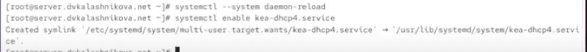{#fig-007 width=70%}

И слегка отредактируем наш файл с прошлой лабораторной работы в папке fz, добавив запись о dhcp (@fig-008).

{#fig-008 width=70%}

То же самое сделаем с rz (@fig-009).

{#fig-009 width=70%}

Перезагрузим сервер ДНС и убедимся, что мы можем пингануть dhcp сервер (@fig-010).

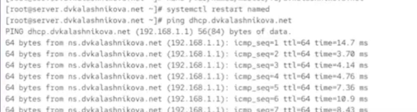{#fig-010 width=70%}

Теперь настроим firewall и обновим метки selinux (@fig-011).

{#fig-011 width=70%}

Убедимся по логам, что сервер ДНС работает и не выдаёт ошибок (@fig-012).

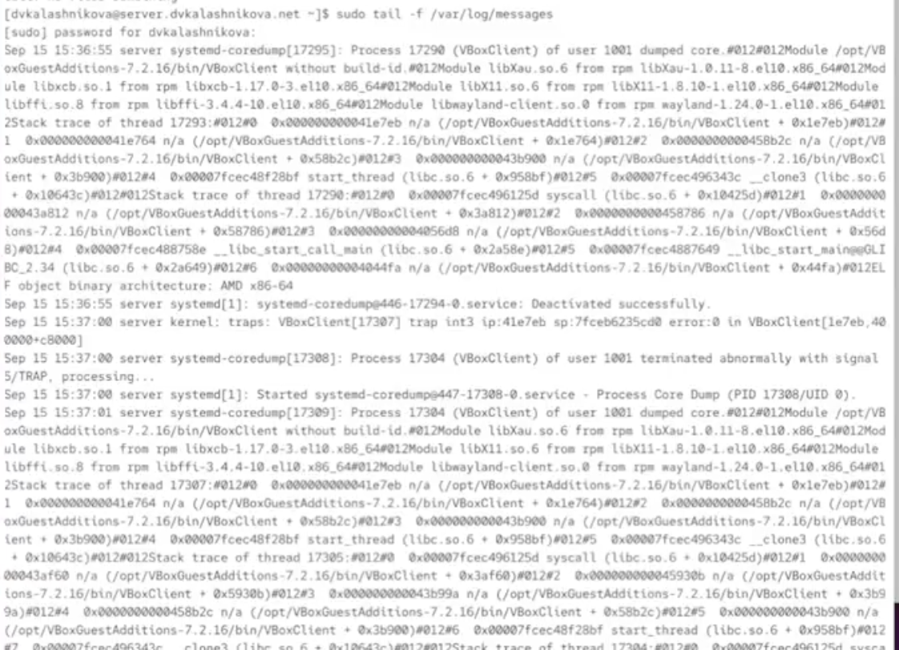{#fig-012 width=70%}

Теперь запускаем dhcp сервер (@fig-013).

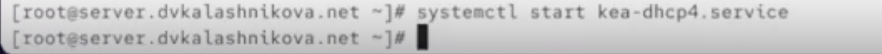{#fig-013 width=70%}

Далее убедимся в том, что в нашей папке клиента в vagrant представлен скрипт следующего содержания для настройки сети, берущей свой ip по dhcp (@fig-014).

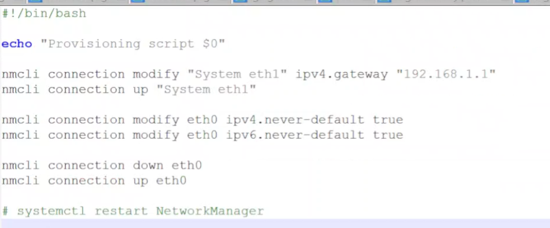{#fig-014 width=70%}

В Vagrantfile мы убедимся, что этот скрипт прописан для запуска (@fig-015).

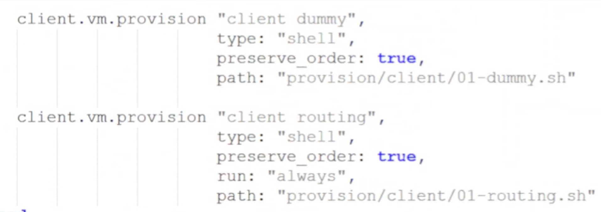{#fig-015 width=70%}

Когда приготовления завершены, мы можем запустить клиент (@fig-016).

{#fig-016 width=70%}

Зайдя в клиент, через ifconfig убедимся, что айпи был получен с сервера. Это так, айпи назначился как 192.168.1.30 (@fig-017).

{#fig-017 width=70%}

Информация о назначении айпи также хранится в файле /var/lib/kea/kea-leases4.csv на сервере (@fig-018).

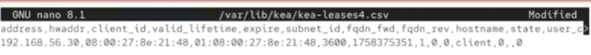{#fig-018 width=70%}

Теперь создадим ключ sha512 и убедимся в том, что он создался (@fig-019).

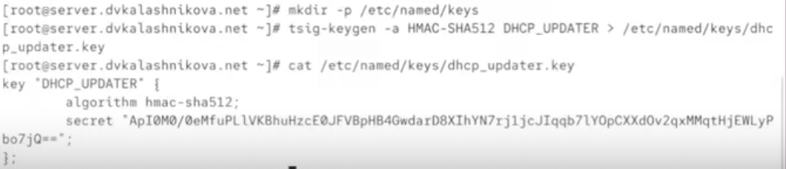{#fig-019 width=70%}

Этот ключ добавим в /etc/named.conf (@fig-020).

{#fig-020 width=70%}

Обновим файл /etc/named/dvkalashnikova.net, добавив туда dhcp (@fig-021).

{#fig-021 width=70%}

Проверим корректность конфига на синтаксис и перезапустим DNS службу, а также создадим файл с ключом (@fig-022).

{#fig-022 width=70%}

В созданный файл вставим ключ, который мы сгенерировали ранее (@fig-023).

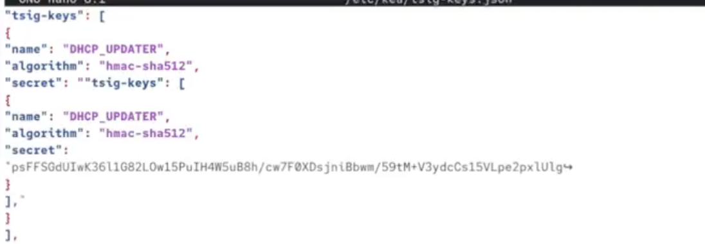{#fig-023 width=70%}

Поменяем права и владельца созданного файла, предоставив его системному пользователю службы (@fig-024).

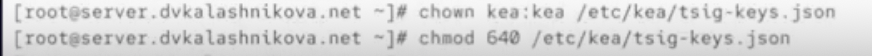{#fig-024 width=70%}

Теперь заполним файл конфигурации ddns, который перепишем с нуля согласно данному шаблону, поменяв имя на свой домен (@fig-025).

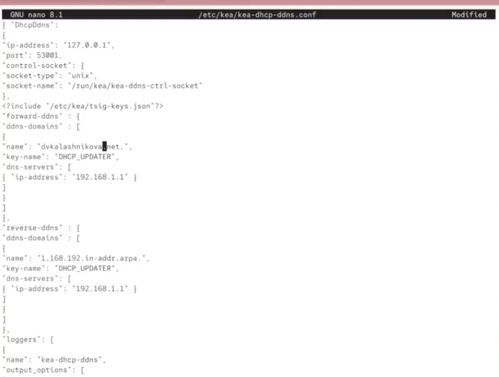{#fig-025 width=70%}

Предоставим этот файл во владение системному пользователю, а также загрузим эту конфигурацию, и убедимся, что она загружена успешно. После этого перезапустим ddns службу (@fig-026).

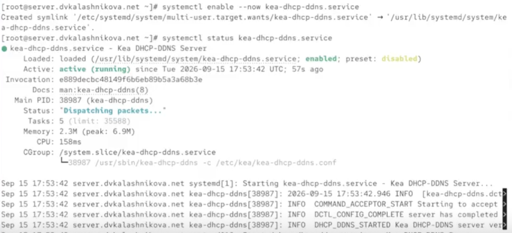{#fig-026 width=70%}

Теперь добавим информацию о ddns в наш файл с конфигурацией dhcp (@fig-027).

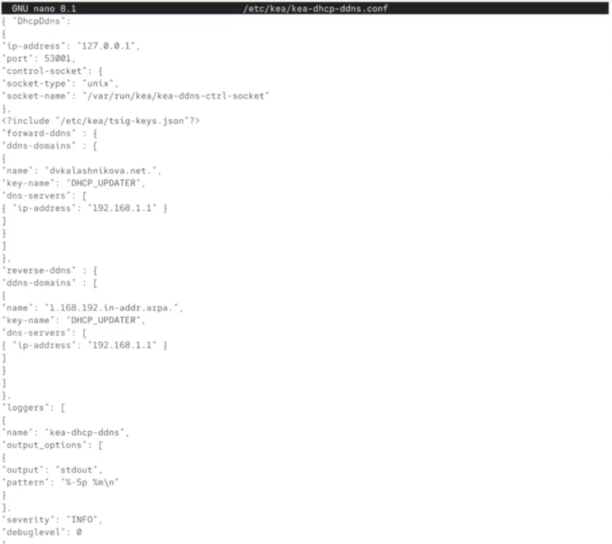{#fig-027 width=70%}

Вновь загрузим конфигурацию и перезапустим службу dhcp (@fig-028).

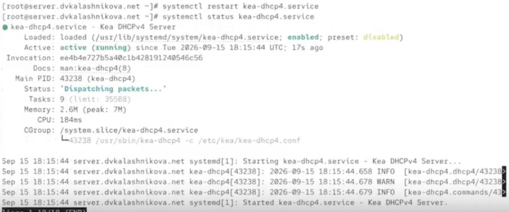{#fig-028 width=70%}

Теперь на клиенте перезапустим интернет, чтобы обновить данные (@fig-029).

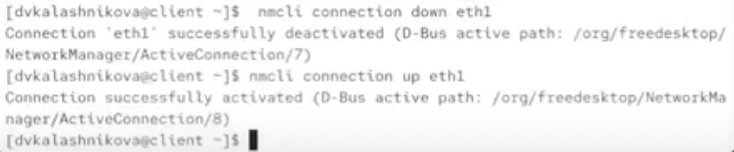{#fig-029 width=70%}

Теперь через dig получим информацию о нашем сервере (@fig-030).

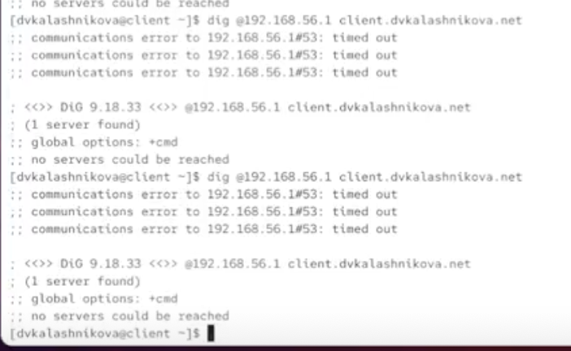{#fig-030 width=70%}

Теперь переместим данные созданных ранее конфигураций в вагрант, после чего создадим скрипт (@fig-031).

{#fig-031 width=70%}

В скрипте напишем алгоритм настройки dhcp (@fig-032).

{#fig-032 width=70%}

# Выводы

В результате выполнения работы были получены навыки настройки dhcp.
