# Информация

## Докладчик

:::::::::::::: {.columns align=center}
::: {.column width="70%"}

  * Калашникова Дарья Викторовна
  * Студент
  * Российский университет дружбы народов
  * [1132243108@pfur.ru](mailto:1132243108@pfur.ru)

:::
::: {.column width="30%"}

:::
::::::::::::::

## Цель работы

Приобретение практических навыков по установке и базовому конфигурированию HTTP-сервера Apache.

## Запуск сервера

Запускаем виртуальную машину сервера через vagrant.

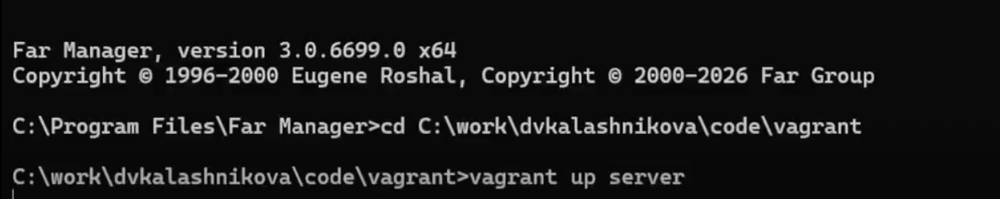{#fig:001 width=60%}

## Установка пакетов

Устанавливаем пакет httpd и сопутствующие утилиты для работы веб-сервера.

{#fig:002 width=30%}

## /etc/httpd/conf/httpd.conf

Основной конфигурационный файл Apache — в нём задаются глобальные параметры сервера.

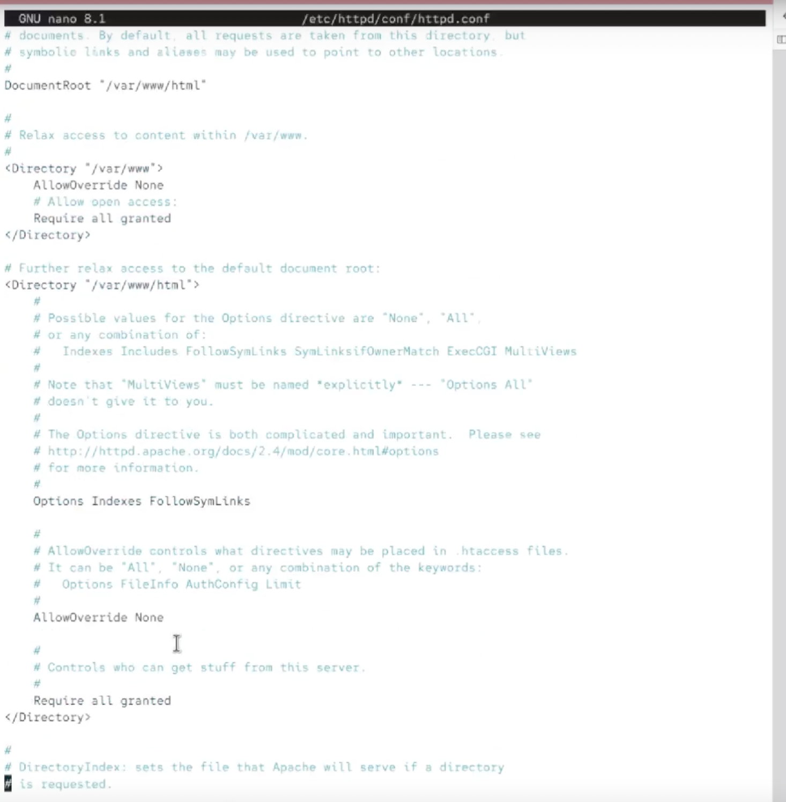{#fig:003 width=30%}

## /etc/httpd/conf/magic

Файл с инструкциями для определения MIME-типа файла по его содержимому.

{#fig:004 width=30%}

## /etc/httpd/conf.d/autoindex.conf

Настройки автоматического отображения списка файлов в директории.

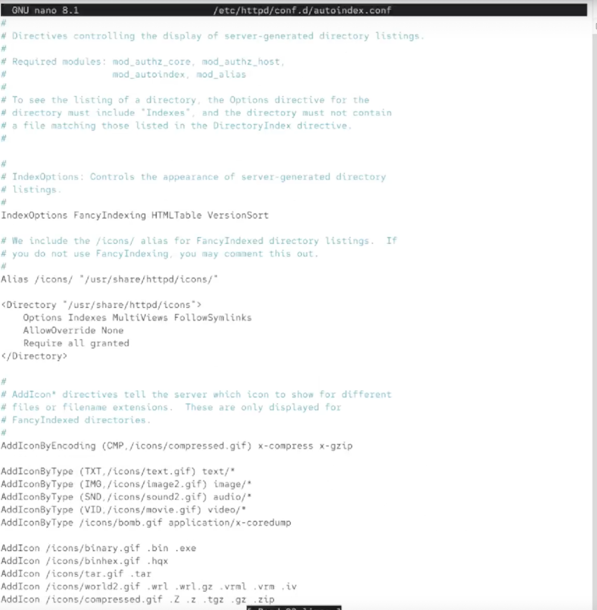{#fig:005 width=30%}

## /etc/httpd/conf.d/manual.conf

Настройки доступа к веб-странице с документацией Apache.

{#fig:006 width=60%}

## /etc/httpd/conf.d/userdir.conf

Настройки доступа к публичным веб-директориям пользователей системы.

{#fig:007 width=40%}

## /etc/httpd/conf.d/fcgid.conf

Настройки модуля mod_fcgid для запуска скриптов через FastCGI.

{#fig:008 width=60%}

## /etc/httpd/conf.d/ssl.conf

Настройки поддержки шифрования SSL/TLS.

{#fig:009 width=30%}

## Настройка firewall

Добавляем службу http в фаервол, чтобы клиент мог обращаться к веб-серверу.

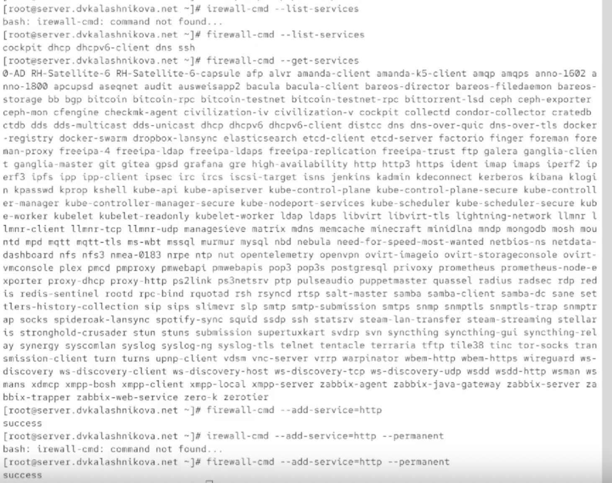{#fig:010 width=50%}

## journalctl

Запускаем journalctl с ключом -f для отслеживания логов в реальном времени.

{#fig:011 width=60%}

## Запуск службы httpd

Запускаем службу httpd и включаем её автозагрузку.

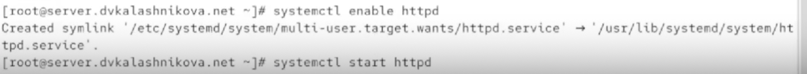{#fig:012 width=60%}

## Лог об успешном запуске

В журнале видим, что запуск httpd прошёл успешно.

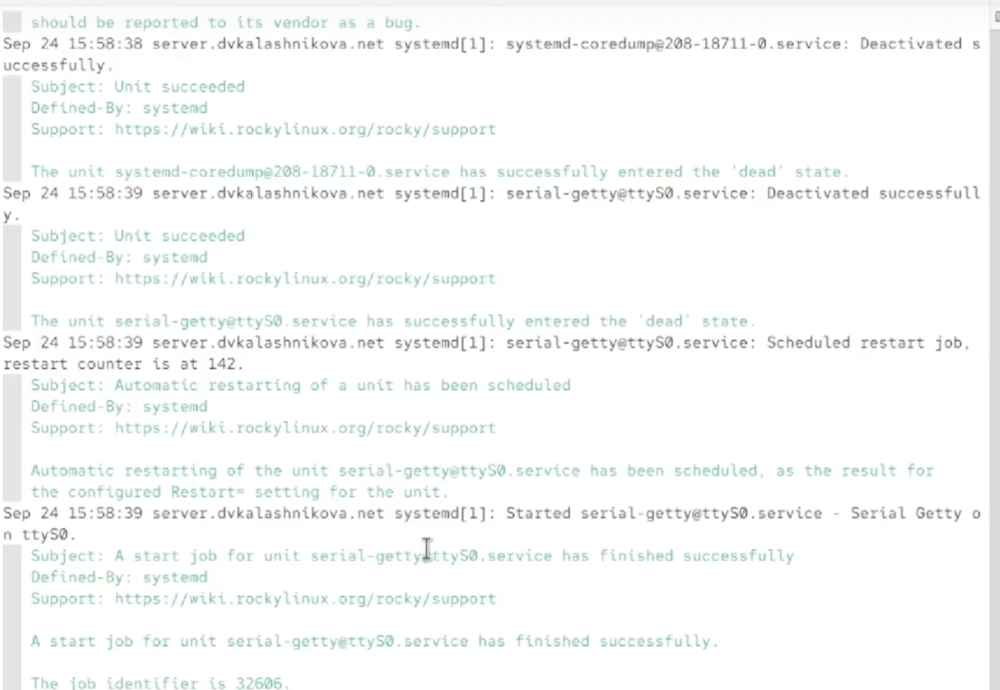{#fig:013 width=60%}

## Запуск клиента

Запускаем виртуальную машину клиента через vagrant.

{#fig:014 width=60%}

## Страница по умолчанию

Переходим в браузере клиента по адресу 192.168.1.1 — видим страницу по умолчанию.

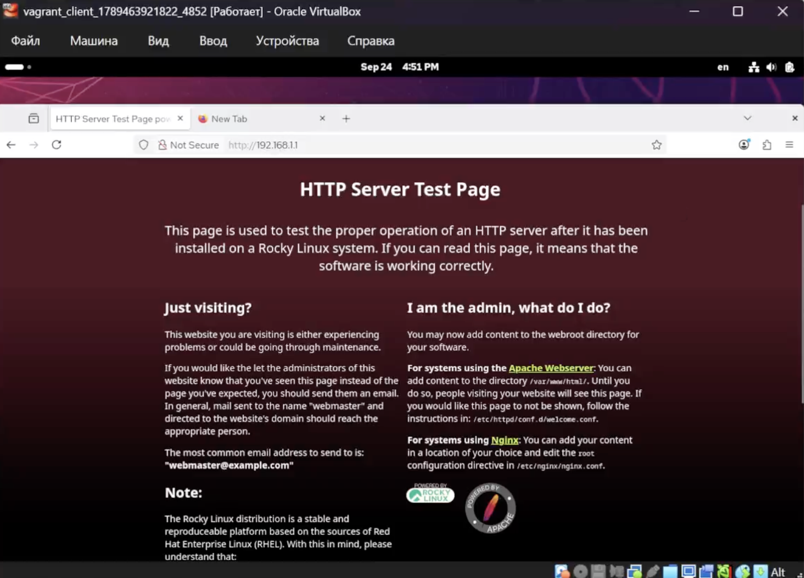{#fig:015 width=50%}

## /var/log/httpd/error_log

Смотрим лог ошибок веб-сервера — он пуст, ошибок нет.

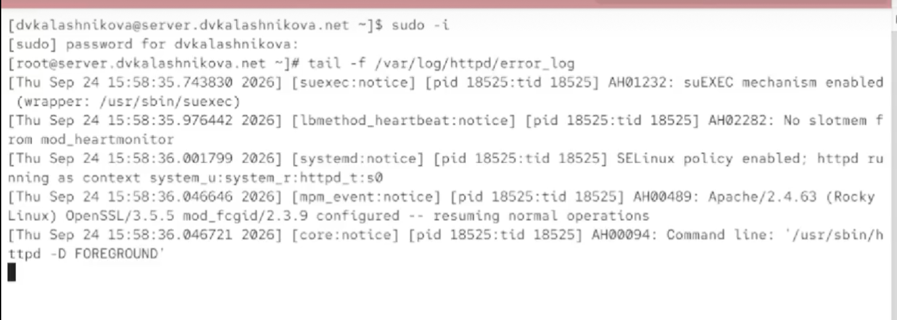{#fig:016 width=60%}

## /var/log/httpd/access_log

Смотрим лог доступа — в нём фиксируется обращение клиента к серверу.

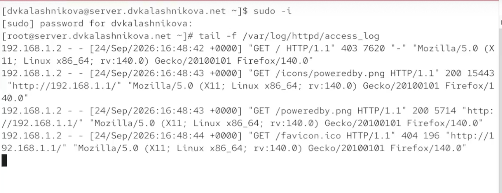{#fig:017 width=60%}

## Остановка службы named

Останавливаем DNS-службу, чтобы заменить файлы зон.

{#fig:018 width=60%}

## Файл зоны /var/named/master/fz/dvkalashnikova

Добавляем в прямую зону запись о новом http-сервере www.

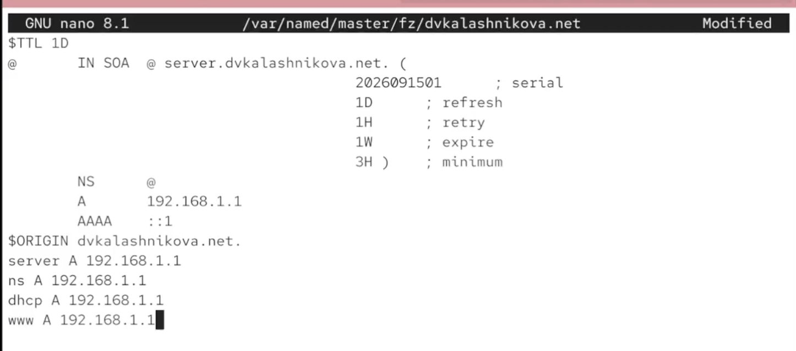{#fig:019 width=60%}

## Файл зоны /var/named/master/rz/192.168.1

Аналогичную запись добавляем в обратную зону.

{#fig:020 width=60%}

## Удаление журналов

Удаляем журналы из папок прямой и обратной зон, чтобы применить изменения.

{#fig:021 width=60%}

## Создание конфигурационных файлов

Создаём файлы конфигурации для двух страниц — server и www.

{#fig:022 width=60%}

## server.dvkalashnikova.net

Помещаем в первый файл настройки виртуального хоста server.dvkalashnikova.net.

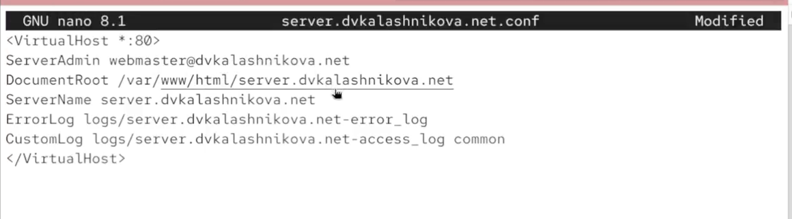{#fig:023 width=60%}

## www.dvkalashnikova.net

Во второй файл помещаем настройки виртуального хоста www.dvkalashnikova.net.

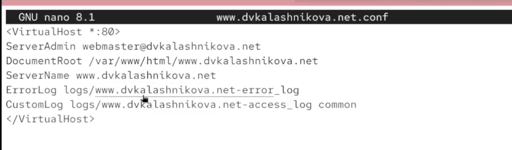{#fig:024 width=60%}

## Файлы index.html

Создаём папки сайтов и кладём в них простые приветственные страницы index.html.

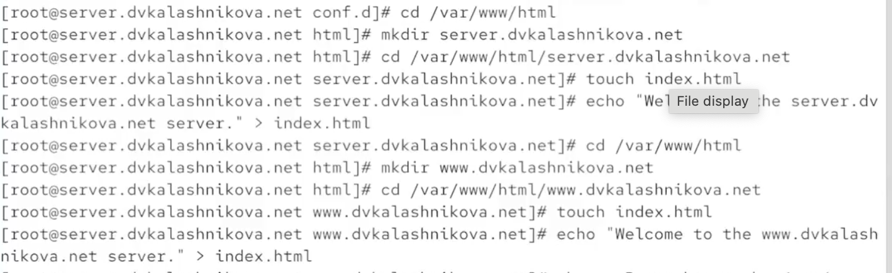{#fig:025 width=60%}

## Обновление меток и перезапуск службы

Обновляем метки SELinux и перезапускаем службу httpd.

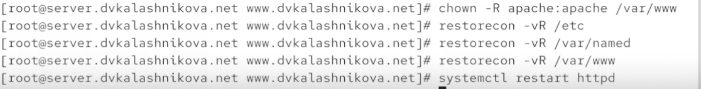{#fig:026 width=60%}

## server.dvkalashnikova.net

С клиента переходим по адресу server.dvkalashnikova.net — видим приветственную страницу.

{#fig:027 width=60%}

## Обновление конфигурации vagrant

Переносим готовые конфиги в папку provision/server и создаём скрипт http.sh.

{#fig:028 width=60%}

## Скрипт http.sh

В скрипте http.sh описываем алгоритм автоматической настройки http-сервера.

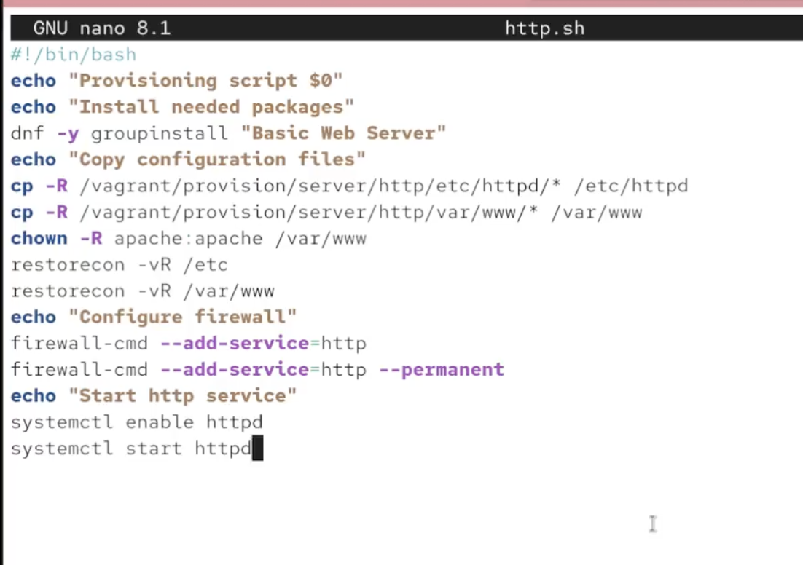{#fig:029 width=60%}

## Vagrantfile

В Vagrantfile добавляем запуск скрипта http.sh при поднятии сервера.

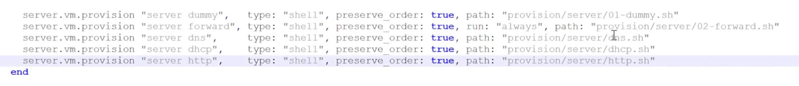{#fig:030 width=60%}

## Выводы

В результате выполнения лабораторной работы были получены навыки работы и настройки http сервера
