# Цель работы

Приобретение практических навыков по установке и базовому конфигурированию HTTP-сервера Apache.

# Выполнение лабораторной работы

Для начала запустим наш сервер через vagrant (@fig-001).

{#fig-001}

Установим пакеты, необходимые для работы веб-сервера (@fig-002).

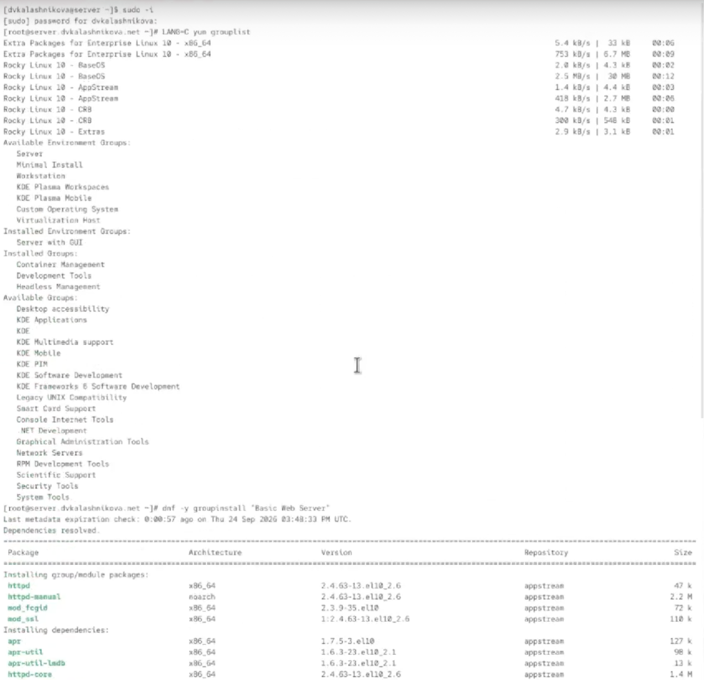{#fig-002}

Проанализируем содержимое конфигурационных файлов сервера. Начнём с файла /etc/httpd/conf/httpd.conf. В нём содержатся основные настройки веб-сервера Apache (@fig-003).

{#fig-003}

В файле /etc/httpd/conf/magic содержатся инструкции для определения MIME-типа файла по его содержимому, а не расширению (@fig-004).

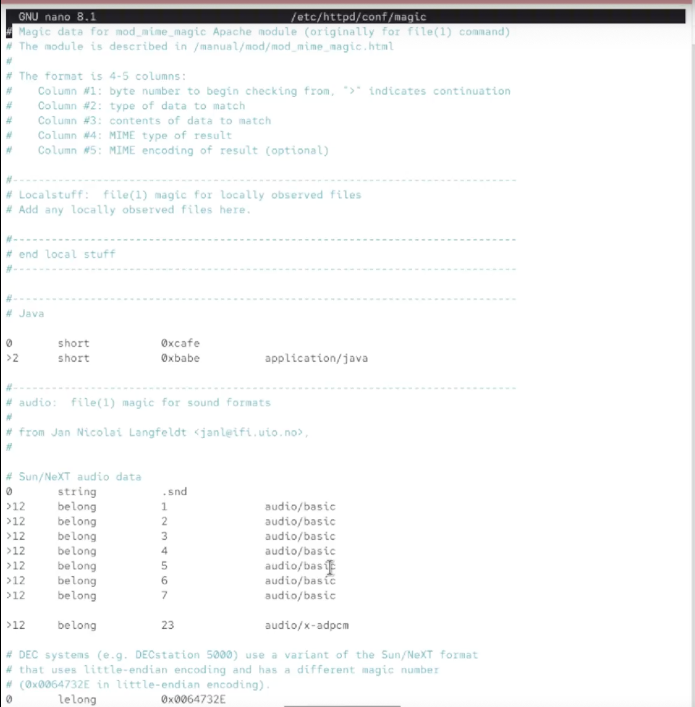{#fig-004}

В файле /etc/httpd/conf.d/autoindex.conf содержатся настройки для автоматического отображения списка файлов в директории (@fig-005).

{#fig-005}

В файле /etc/httpd/conf.d/manual.conf содержатся настройки для доступа к веб-странице с документацией Apache (@fig-006).

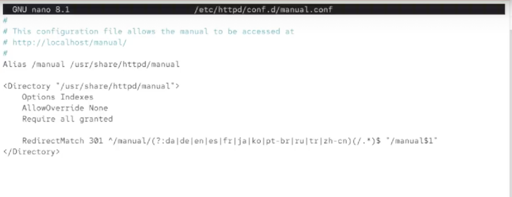{#fig-006}

В файле /etc/httpd/conf.d/userdir.conf содержатся настройки для доступа к публичным веб-директориям пользователей системы (@fig-007).

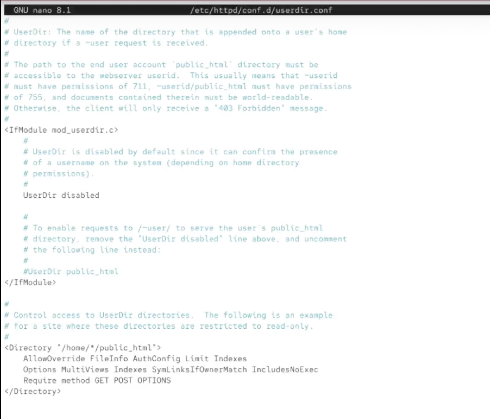{#fig-007}

В файле /etc/httpd/conf.d/fcgid.conf содержатся настройки для модуля mod_fcgid, который используется для запуска скриптов (например, PHP) через FastCGI (@fig-008).

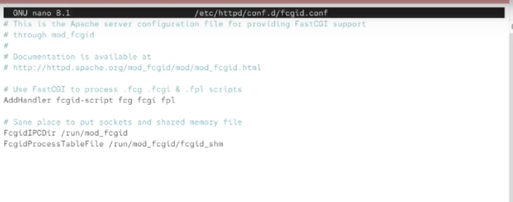{#fig-008}

В файле /etc/httpd/conf.d/ssl.conf содержатся настройки для поддержки шифрования SSL/TLS (@fig-009).

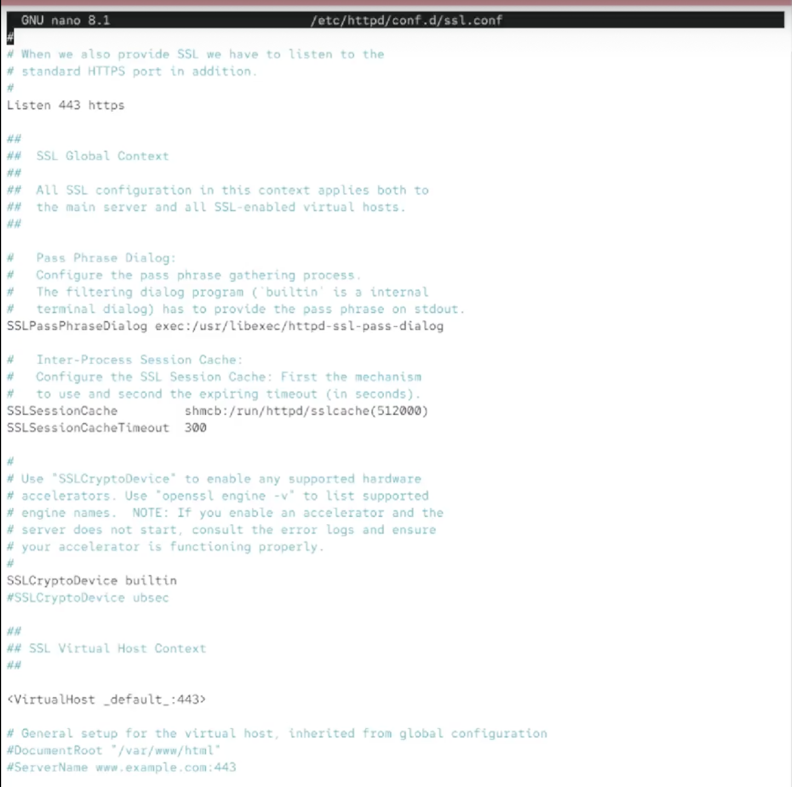{#fig-009}

Теперь добавим службу http в фаервол для корректной работы (@fig-010).

{#fig-010}

Запустим в отдельной вкладке journalctl с ключом -f для вывода информации логов в реальном времени (@fig-011).

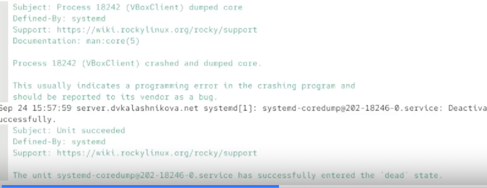{#fig-011}

Теперь попробуем запустить службу httpd и включить в ней автозагрузку (@fig-012).

{#fig-012}

Вернёмся ко вкладке с journalctl. Как видим, запуск httpd был успешен (@fig-013).

{#fig-013}

Теперь запустим клиент (@fig-014).

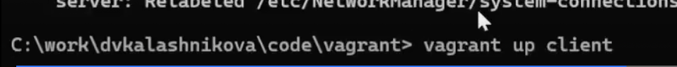{#fig-014}

Зайдём в клиенте в браузер и перейдём по адресу 192.168.1.1. Как видим, это страница, которая используется вебсервером по умолчанию. Таким образом, она даёт нам понять, что Служба httpd работает корректно, и клиент может получить доступ к содержимому веб-страницы (@fig-015).

{#fig-015}

Теперь выведем логи об ошибках веб-сервера в файле /var/log/httpd/error_log (@fig-016).

{#fig-016}

И выведем лог о доступе к веб-странице в файле /var/log/httpd/access_log (@fig-017).

{#fig-017}

Остановим службу named, отвечающую за dns (@fig-018).

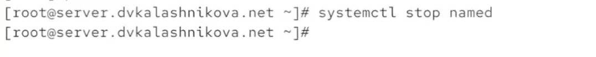{#fig-018}

Поменяем файл зоны, добавив в него запись о том, что теперь у нас есть http сервер (www) (@fig-019).

{#fig-019}

То же самое сделаем в обратном файле зоны (@fig-020).

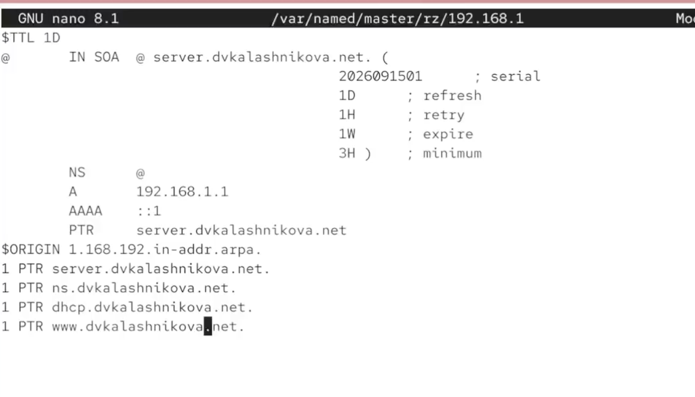{#fig-020}

Удалим файлы журналов из папок обратной и прямой зон (@fig-021).

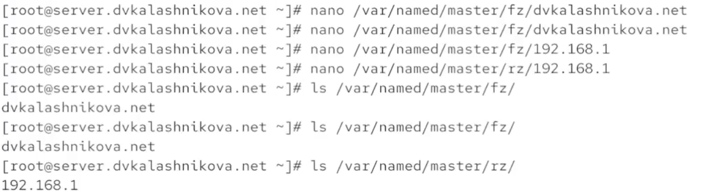{#fig-021}

Теперь запустим dns службу и перейдём в папку с конфигурацией httpd (/etc/httpd/conf.d), создав там файлы конфигурации для двух страниц - server.dvkalashnikova.net и www.dvkalashnikova.net (@fig-022).

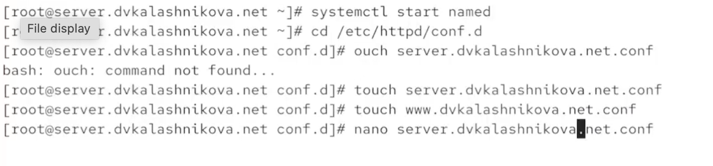{#fig-022}

Поместим следующее содержимое в первый из файлов (@fig-023).

{#fig-023}

И следующее содержимое во второй файл (@fig-024).

{#fig-024}

В папке /var/www/html создадим папки server.dvkalashnikova.net и www.dvkalashnikova.net. В каждой из них создадим файл index.html, в каждый из которых запишем простую приветственную фразу (@fig-025).

{#fig-025}

Теперь обновим метки для SElinux и перезапустим службу httpd (@fig-026).

{#fig-026}

Теперь с клиента попробуем перейти по адресу server.dvkalashnikova.net. Как видим, нам вывело страницу с той самой фразой, которую мы записывали в index.html ранее (@fig-027).

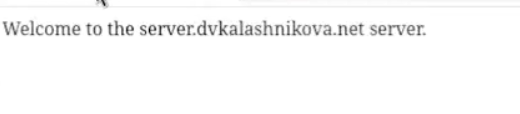{#fig-027}

Теперь обновим конфигурацию vagrant, поместив обновлённые конфиги и все созданные в ходе лабораторной работы файлы в папку /vagrant/provision/server. Кроме того, создадим скрипт http.sh (@fig-028).

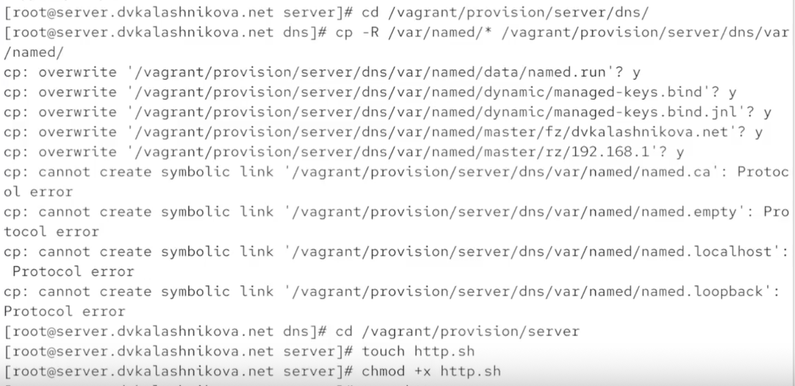{#fig-028}

В скрипт http.sh пропишем следующее содержимое, позволяющее настроить наш http сервер (@fig-029).

{#fig-029}

Отредактируем Vagrantfile, добавив в его конфигурацию запуск созданного ранее скрипта (@fig-030).

{#fig-030}

# Выводы

В результате выполнения лабораторной работы были получены навыки работы и настройки http сервера
