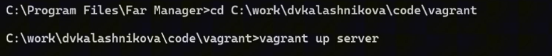
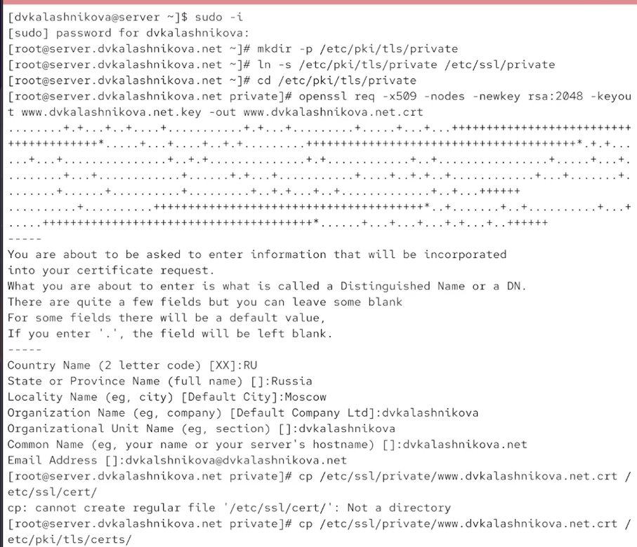
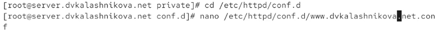
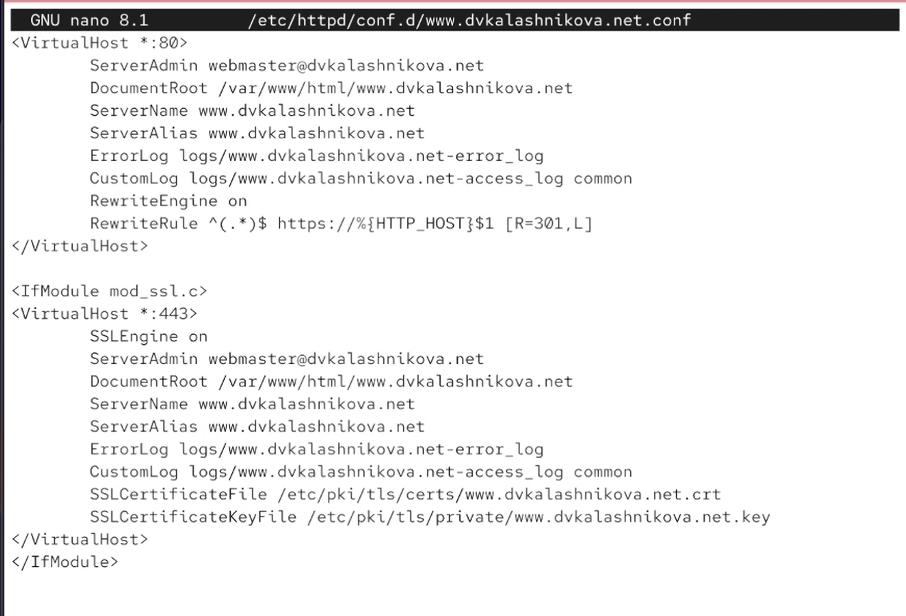
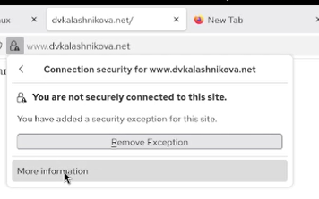
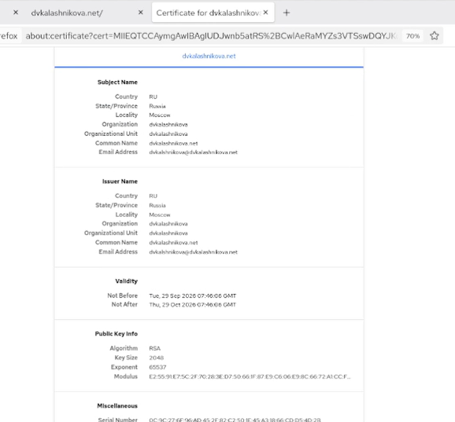
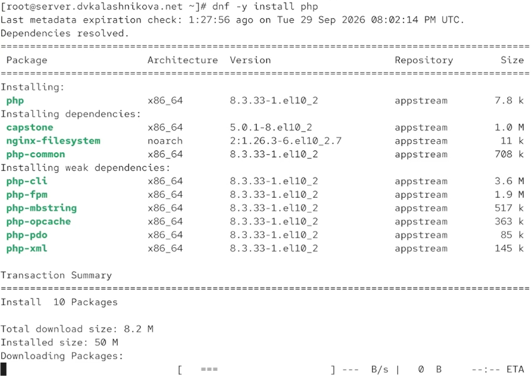
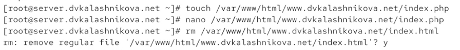
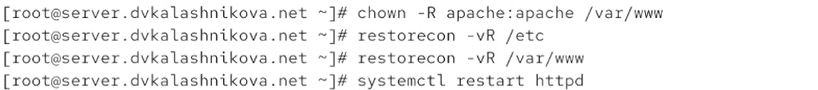
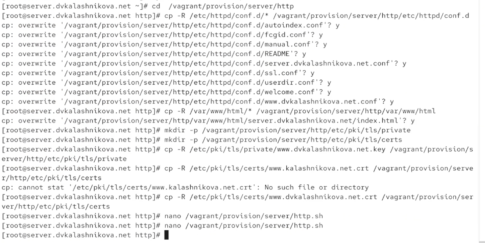

# Информация

## Докладчик

:::::::::::::: {.columns align=center}
::: {.column width="70%"}

  * Калашникова Дарья Викторовна
  * Студент
  * Российский университет дружбы народов
  * [1132243108@pfur.ru](mailto:1132243108@pfur.ru)

:::
::: {.column width="30%"}

:::
::::::::::::::

## Цель работы

Получить практические навыки расширенной настройки HTTP-сервера Apache: защита соединения и поддержка PHP.

## Старт сервера

Поднимаем сервер через vagrant и убеждаемся, что он запустился.

{#fig:001 width=60%}

## Генерация сертификата

Создаём SSL-сертификат в /etc/pki/tls/private и копируем его в /etc/ssl/certs.

{#fig:002 width=40%}

## Правка конфигурационного файла httpd

Открываем в /etc/httpd/conf.d файл www.dvkalashnikova.net.conf.

{#fig:003 width=60%}

## www.dvkalashnikova.net.conf

Приводим конфиг к виду с поддержкой HTTPS: два блока VirtualHost и редирект с 80 на 443.

{#fig:004 width=50%}

## Настройки фаервола

Разрешаем работу по https через firewall-cmd и перезапускаем httpd.

{#fig:005 width=30%}

## Предупреждение браузера

На клиенте открываем сайт — браузер предупреждает, что сертификат самоподписанный.

{#fig:006 width=60%}

## Открытие сайта

Подтверждаем переход и видим, что соединение идёт по https.

{#fig:007 width=60%}

## Просмотр сертификата

В сертификате те же данные, что мы указывали при создании.

{#fig:008 width=40%}

## Установка PHP

Ставим на сервер пакет php для обработки динамических страниц.

{#fig:009 width=60%}

## Замена index.html на index.php

В /var/www/html/www.dvkalashnikova.net создаём index.php вместо старого index.html.

{#fig:010 width=60%}

## Содержимое index.php

В index.php записываем приветственный код с использованием PHP.

{#fig:011 width=60%}

## Настройка прав доступа

Возвращаем метки SELinux, меняем владельца /var/www на apache и перезапускаем службу.

{#fig:012 width=60%}

## Как выглядит сайт

Проверяем с клиента — сайт отдаёт страницу, сгенерированную PHP.

{#fig:013 width=60%}

## Сохранение конфигурации

Переносим получившиеся конфиги в provision/server для vagrant.

{#fig:014 width=60%}

## Скрипт http.sh

Дорабатываем http.sh: он ставит php и открывает https в фаерволе.

{#fig:015 width=60%}

## Выводы

В ходе лабораторной работы получены навыки расширенного конфигурирования HTTP-сервера Apache и организации https.

## Список литературы

1. Apache Software Foundation. Apache HTTP Server Documentation [Электронный ресурс]. — URL: https://httpd.apache.org/docs/ (дата обращения: 25.09.2026).

2. Apache Software Foundation. mod_ssl — SSL/TLS Encryption [Электронный ресурс]. — URL: https://httpd.apache.org/docs/2.4/mod/mod_ssl.html (дата обращения: 25.09.2026).

3. Red Hat. Documentation [Электронный ресурс]. — URL: https://docs.redhat.com/ (дата обращения: 25.09.2026).
