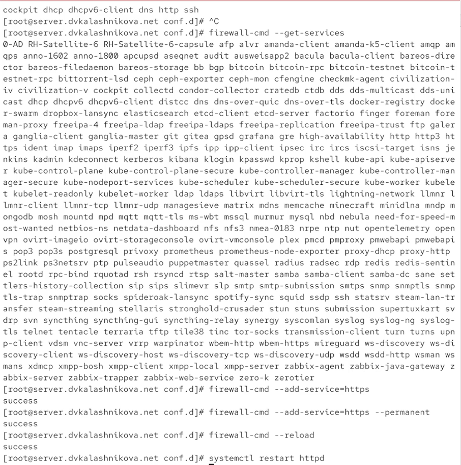
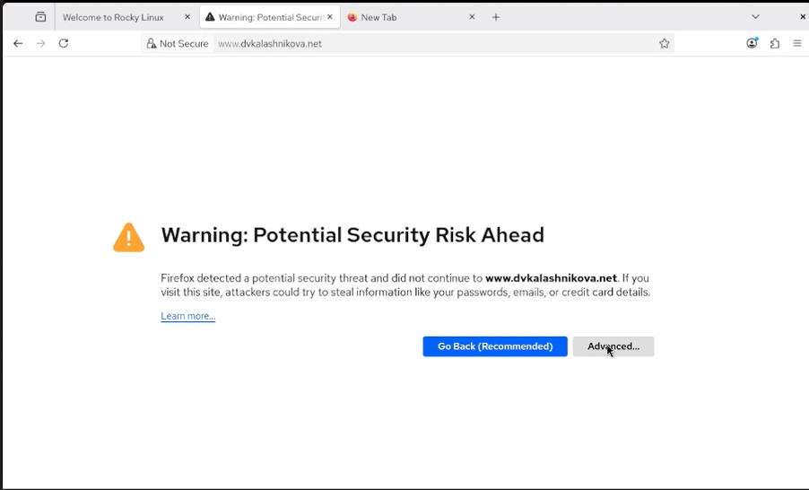
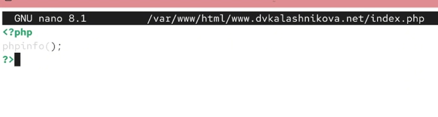
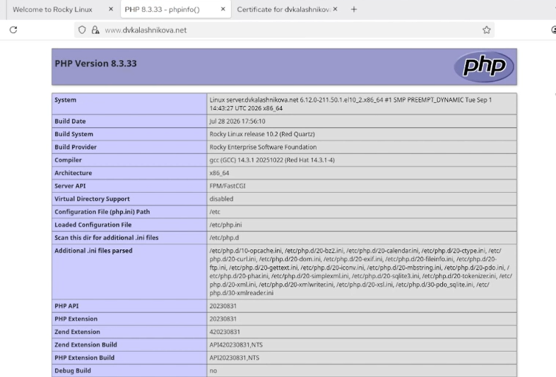
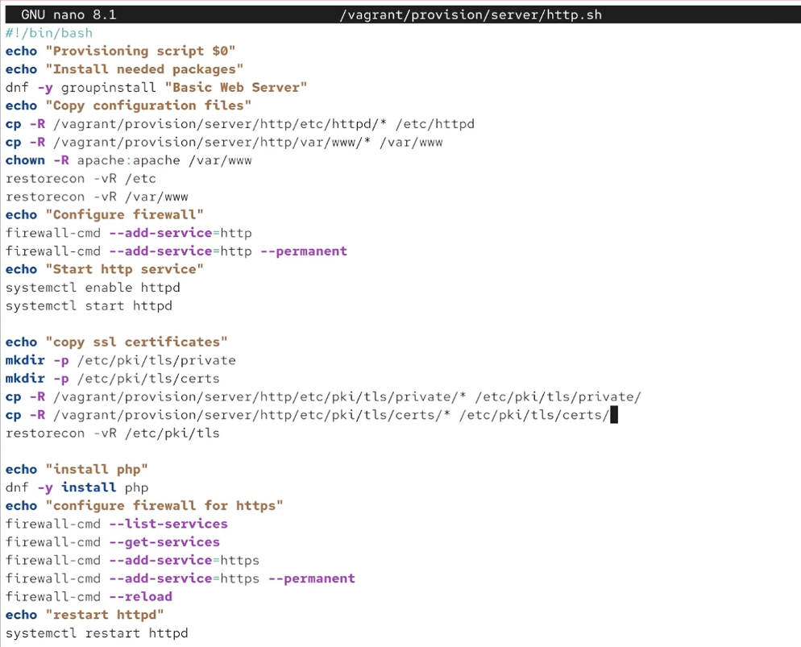

# Цель работы

Получить практические навыки расширенной настройки HTTP-сервера Apache — в части защиты соединения и поддержки PHP.

# Выполнение лабораторной работы

Сначала поднимем сервер через vagrant (@fig-001).

{#fig-001}

Затем создадим сертификат. Разместим его в каталоге /etc/pki/tls/private, который предварительно сделаем симлинком на /etc/ssl/private. После генерации скопируем сертификат в /etc/ssl/certs (@fig-002).

{#fig-002}

Перейдём в /etc/httpd/conf.d и откроем на редактирование конфигурационный файл www.dvkalashnikova.net.conf (@fig-003).

{#fig-003}

Приведём его к следующему виду, добавив поддержку https, и разберём каждую строку (@fig-004):

1: Начало блока виртуального хоста, принимающего запросы на всех IP-адресах (*) по порту 80 (стандартный HTTP).  
2: Контактный email администратора сайта — может выводиться на страницах ошибок.  
3: Корневая директория (/var/www/html/www.dvkalashnikova.net), в которой лежат файлы сайта.  
4: Основное доменное имя, по которому доступен сайт.  
5: Дополнительные (альтернативные) имена этого же хоста; здесь дублируется основное.  
6: Путь к журналу ошибок.  
7: Путь к журналу доступа в стандартном формате common.  
8: Подключение модуля mod_rewrite для преобразования URL.  
9: Правило, перенаправляющее все HTTP-запросы на HTTPS с кодом 301 (постоянное перенаправление).  
10: Конец блока виртуального хоста для порта 80.  
11: Начало условного блока — его содержимое применяется только при загруженном модуле mod_ssl.  
12: Начало блока виртуального хоста, обслуживающего порт 443 (стандартный HTTPS).  
13: Включение шифрования SSL/TLS для данного хоста.  
14: Email администратора для этого хоста.  
15: Корневая директория сайта для HTTPS-версии.  
16: Основное доменное имя для HTTPS-хоста.  
17: Альтернативные имена для HTTPS-хоста.  
18: Путь к журналу ошибок HTTPS-хоста.  
19: Путь к журналу доступа HTTPS-хоста.  
20: Путь к публичному SSL-сертификату (.crt).  
21: Путь к приватному ключу SSL (.key).  
22: Конец блока виртуального хоста для порта 443.  
23: Конец условного блока IfModule.

{#fig-004}

Далее через фаервол разрешим работу по https и перезапустим службу httpd (@fig-005).

{#fig-005}

Перейдём на клиентскую машину. Попробуем открыть сайт www.dvkalashnikova.net — браузер предупредит, что соединение не защищено. Всё равно подтвердим переход (@fig-006).

{#fig-006}

Видим, что подключение идёт по https (@fig-007).

{#fig-007}

Откроем сертификат — в нём те же данные, что мы указывали при создании (@fig-008).

{#fig-008}

Установим на сервере пакет php (@fig-009).

{#fig-009}

Вместо старого index.html создадим в /var/www/html/www.dvkalashnikova.net файл index.php (@fig-010).

{#fig-010}

Запишем в index.php следующее (@fig-011).

{#fig-011}

Теперь вернём метки selinux, сменим владельца каталога /var/www на apache и перезапустим службу (@fig-012).

{#fig-012}

Проверим, как сайт отображается на клиентской машине (@fig-013).

{#fig-013}

Сохраним получившуюся конфигурацию для vagrant (@fig-014).

{#fig-014}

И доработаем файл /vagrant/provision/server/http.sh так, чтобы он устанавливал php и настраивал firewall для https (@fig-015).

{#fig-015}

# Выводы

В ходе лабораторной работы получены навыки расширенного конфигурирования HTTP-сервера Apache и организации https.

# Список литературы {.unnumbered}

1. Apache Software Foundation. Apache HTTP Server Documentation [Электронный ресурс]. — URL: https://httpd.apache.org/docs/ (дата обращения: 25.09.2026).

2. Apache Software Foundation. mod_ssl — SSL/TLS Encryption [Электронный ресурс]. — URL: https://httpd.apache.org/docs/2.4/mod/mod_ssl.html (дата обращения: 25.09.2026).

3. Red Hat. Deploying a web server on Red Hat Enterprise Linux [Электронный ресурс]. — URL: https://docs.redhat.com/ (дата обращения: 25.09.2026).
