# Информация

## Докладчик

:::::::::::::: {.columns align=center}
::: {.column width="70%"}

  * Калашникова Дарья Викторовна
  * Студент
  * Российский университет дружбы народов
  * [1132243108@pfur.ru](mailto:1132243108@pfur.ru)

:::
::: {.column width="30%"}

:::
::::::::::::::

## Цель работы

Освоить установку и настройку системы управления базами данных на примере MariaDB.

## Запуск сервера

Поднимаем сервер через vagrant.

{#fig-001 width=60%}

## Установка пакета

Ставим пакет MariaDB.

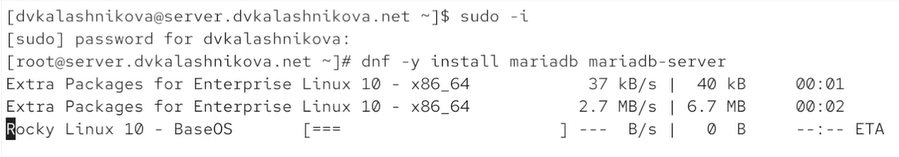{#fig-002 width=60%}

## /etc/my.cnf

Основной конфиг MariaDB: секция client-server и директива !includedir /etc/my.cnf.d.

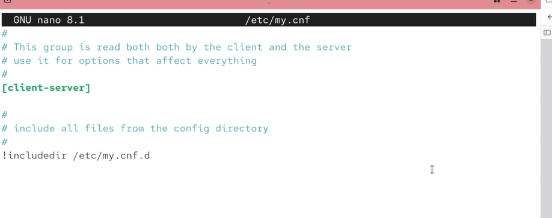{#fig-003 width=60%}

## auth_gssapi.cnf

Подключение плагина аутентификации GSSAPI (Kerberos); строка закомментирована.

{#fig-004 width=60%}

## mariadb-server.cnf

Главный конфиг сервера: datadir, socket, log-error, pid-file, секция Galera.

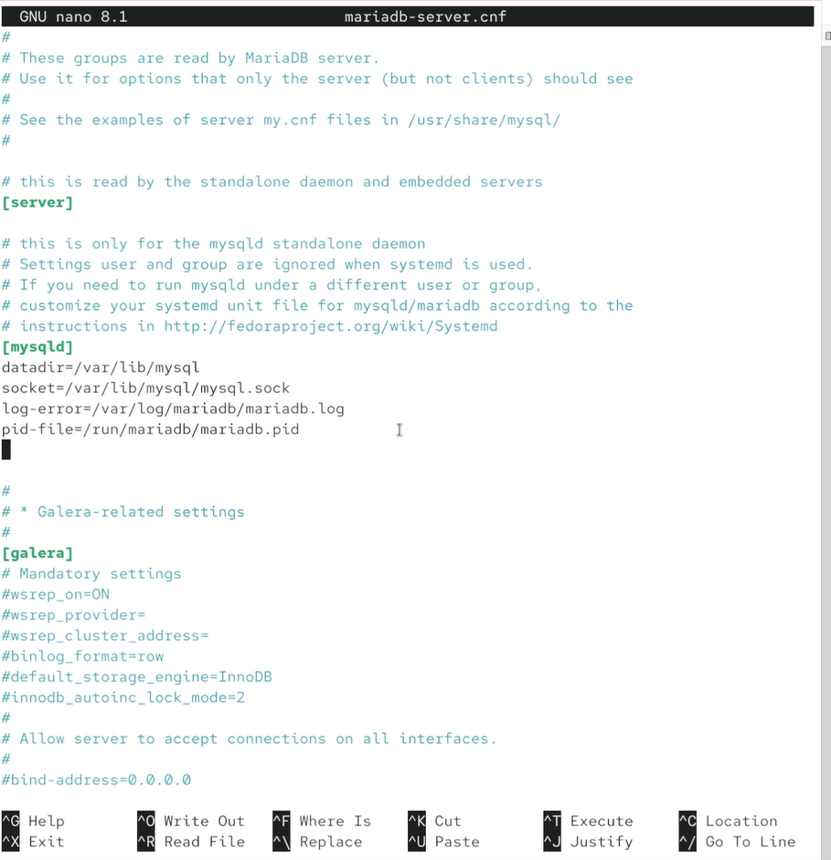{#fig-005 width=60%}

## provider_lz4.cnf

Подключение плагина сжатия LZ4 с принудительной загрузкой.

{#fig-006 width=60%}

## spider.cnf

Подключение движка хранения Spider для шардинга; строка закомментирована.

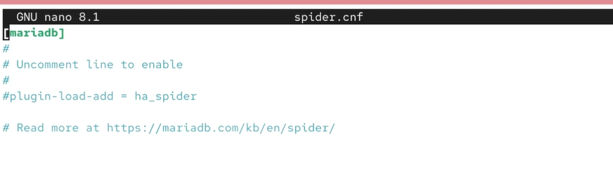{#fig-007 width=60%}

## client.cnf

Конфиг клиентских приложений: секции client и client-mariadb.

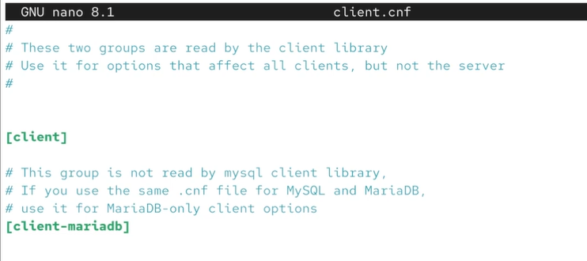{#fig-008 width=60%}

## mysql-clients.cnf

Шаблон с пустыми секциями для отдельных утилит MariaDB.

{#fig-009 width=60%}

## provider_lzo.cnf

Подключение плагина сжатия LZO.

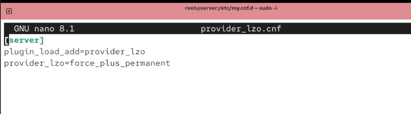{#fig-010 width=60%}

## enable_encryption.preset

Пресет для включения шифрования данных Aria, InnoDB, binlog и временных файлов.

{#fig-011 width=60%}

## provider_bzip2.cnf

Подключение плагина сжатия bzip2.

{#fig-012 width=60%}

## provider_snappy.cnf

Подключение плагина сжатия Snappy.

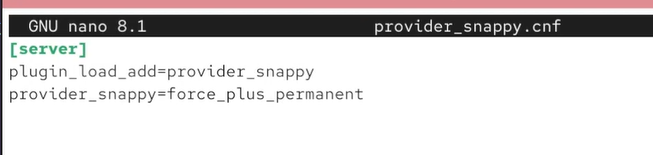{#fig-013 width=60%}

## Запуск mariadb

Запускаем службу, ставим в автозагрузку, проверяем порт 3306 через ss.

{#fig-014 width=60%}

## Настройка БД

Выполняем mysql_secure_installation.

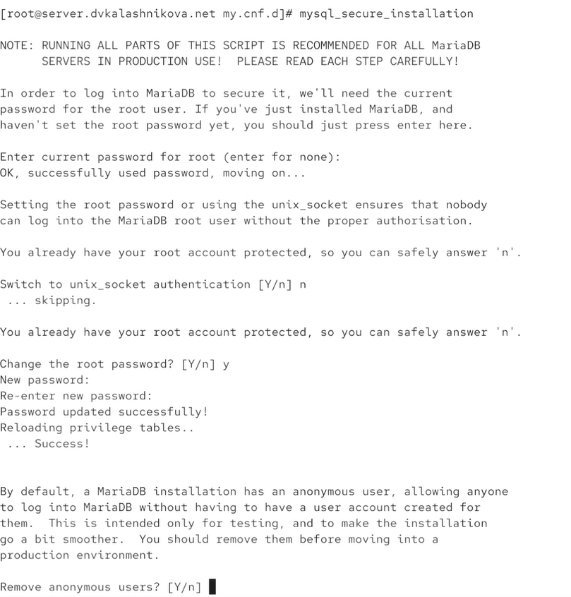{#fig-015 width=60%}

## Подключение к БД

Подключаемся к базе и выводим справку.

{#fig-016 width=60%}

## Списки БД

На этом шаге в базе четыре записи.

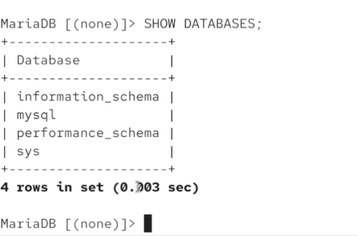{#fig-017 width=60%}

## Статус БД

Версия 10.11.18-MariaDB, id 12, uptime 8 min 2 sec, questions 23, avg 0.047.

{#fig-018 width=60%}

## Создание utf8.cnf

Создаём /etc/my.cnf.d/utf8.cnf для смены кодировки.

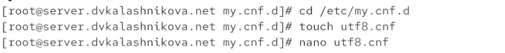{#fig-019 width=60%}

## Содержание файла utf8

Прописываем utf8 как кодировку по умолчанию.

{#fig-020 width=60%}

## Успешная смена кодировки

Перезапускаем mariadb — latin1 меняется на utf8.

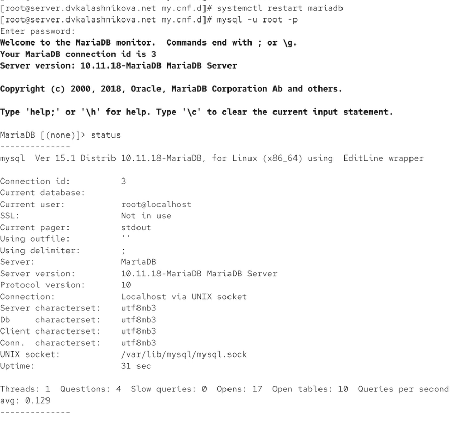{#fig-021 width=60%}

## Наполнение таблицы

Создаём БД addressbook, таблицу city и добавляем Иванова, Петрова, Сидорова.

{#fig-022 width=60%}

## Проверка прав доступа

Создаём пользователя dvkalashnikova и даём доступ к БД.

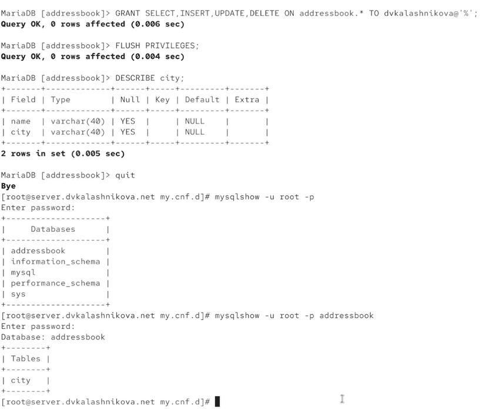{#fig-023 width=60%}

## Бэкапы и сохранение vagrant

Делаем обычный, сжатый и с таймстемпом бэкапы, сохраняем конфиги.

{#fig-024 width=60%}

## mysql.sh

Прописываем в скрипте команды настройки БД.

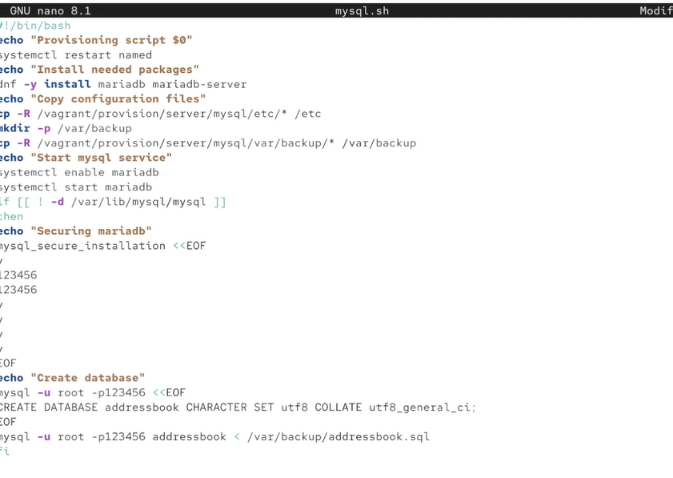{#fig-025 width=60%}

## Vagrantfile

Добавляем автозагрузку mysql.sh.

{#fig-026 width=60%}

## Выводы

Получены навыки работы с базами данных и их настройкой.

## Список литературы

1. MariaDB Foundation. MariaDB Documentation [Электронный ресурс]. — URL: https://mariadb.com/kb/en/documentation/ (дата обращения: 07.10.2026).

2. MariaDB Foundation. MariaDB Server Configuration Files [Электронный ресурс]. — URL: https://mariadb.com/kb/en/configuring-mariadb-with-option-files/ (дата обращения: 07.10.2026).

3. Red Hat. Documentation [Электронный ресурс]. — URL: https://docs.redhat.com/ (дата обращения: 07.10.2026).
