# Цель работы

Освоить установку и настройку системы управления базами данных на примере MariaDB.

# Выполнение лабораторной работы

Для начала поднимем сервер через vagrant (рис. [-@fig:001]).

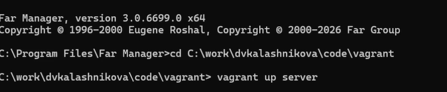{#fig:001}

Затем поставим пакет MariaDB (рис. [-@fig:002]).

{#fig:002}

Далее разберём ключевые конфигурационные файлы.

Файл /etc/my.cnf — основной конфиг MariaDB.  
Секция client-server задаёт параметры, общие и для сервера, и для клиентов.  
Директива !includedir /etc/my.cnf.d указывает MariaDB подгружать все .cnf-файлы из каталога /etc/my.cnf.d — именно через неё подключаются остальные файлы (рис. [-@fig:003]).

{#fig:003}

Файл auth_gssapi.cnf предназначен для подключения плагина аутентификации GSSAPI (Kerberos).  
Секция mariadb относится к настройкам MariaDB.  
Строка plugin-load-add=auth_gssapi.so закомментирована — она отвечает за загрузку плагина GSSAPI (рис. [-@fig:004]).

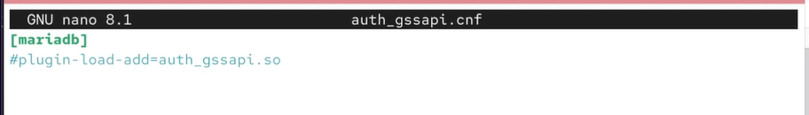{#fig:004}

Файл mariadb-server.cnf — главный конфиг самого сервера.  
Секции server и mysqld описывают параметры серверного процесса mysqld.  
datadir=/var/lib/mysql задаёт каталог, где хранятся базы.  
socket=/var/lib/mysql/mysql.sock указывает путь к сокету для локальных подключений.  
log-error=/var/log/mariadb/mariadb.log — файл журнала ошибок.  
pid-file=/run/mariadb/mariadb.pid — файл с идентификатором процесса сервера.  
Секция galera отвечает за кластер Galera (репликацию).  
wsrep_on=ON включает поддержку Galera.  
wsrep_provider= и wsrep_cluster_address= пока пусты — там должны быть путь к библиотеке Galera и адрес кластера.  
binlog_format=row, default_storage_engine=InnoDB, innodb_autoinc_lock_mode=2 — обязательные параметры для Galera.  
bind-address=0.0.0.0 закомментирован — при включении сервер принимал бы подключения со всех интерфейсов.  
wsrep_slave_threads=1 и innodb_flush_log_at_trx_commit=0 — настройки производительности репликации (рис. [-@fig:005]).

{#fig:005}

Файл provider_lz4.cnf:  
секция server.  
plugin_load_add=provider_lz4 подключает плагин сжатия LZ4.  
provider_lz4=force_plus_permanent заставляет плагин загружаться принудительно и запрещает его выгрузку (рис. [-@fig:006]).

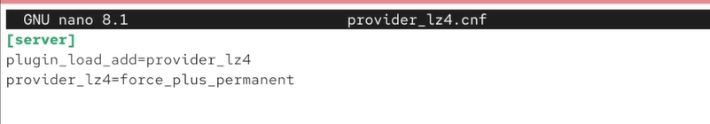{#fig:006}

Файл spider.cnf подключает движок хранения Spider.  
Секция mariadb.  
Строка plugin-load-add = ha_spider закомментирована — она включает плагин Spider для шардинга (распределения данных между серверами) (рис. [-@fig:007]).

{#fig:007}

Файл client.cnf описывает клиентские приложения.  
Секция client — общие параметры для всех клиентов (MySQL и MariaDB).  
Секция client-mariadb — только для клиентов MariaDB (рис. [-@fig:008]).

{#fig:008}

Файл mysql-clients.cnf — шаблон для настройки отдельных утилит MariaDB.  
В нём есть пустые секции mysql, mysql_upgrade, mysqldump, mysqladmin и др. В них можно прописывать специфичные параметры для каждой утилиты (рис. [-@fig:009]).

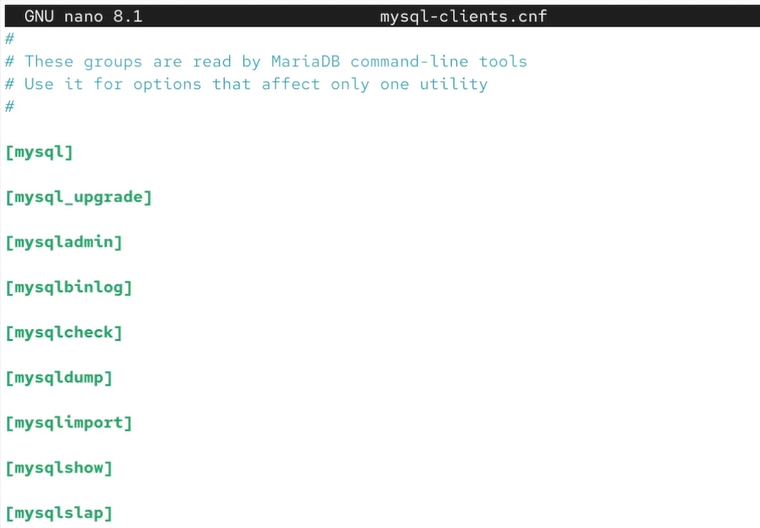{#fig:009}

Файл provider_lzo.cnf:  
секция server.  
plugin_load_add=provider_lzo подключает плагин сжатия LZO.  
provider_lzo=force_plus_permanent — принудительная загрузка, запрет выгрузки (рис. [-@fig:010]).

{#fig:010}

Файл enable_encryption.preset — пресет для включения шифрования данных «в состоянии покоя».  
Секция mariadb.  
Директивы aria-encrypt-tables, encrypt-binlog, encrypt-tmp-disk-tables, encrypt-tmp-files, loose-innodb-encrypt-log, loose-innodb-encrypt-tables включают шифрование для таблиц Aria и InnoDB, бинарного лога и временных файлов (рис. [-@fig:011]).

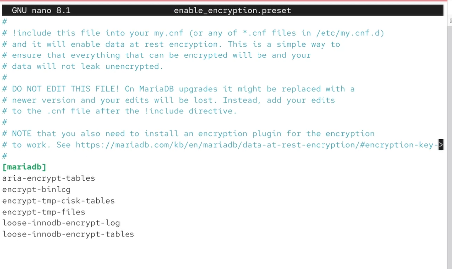{#fig:011}

Файл provider_bzip2.cnf:  
секция server.  
plugin_load_add=provider_bzip2 подключает плагин сжатия bzip2.  
provider_bzip2=force_plus_permanent — принудительная загрузка, запрет выгрузки (рис. [-@fig:012]).

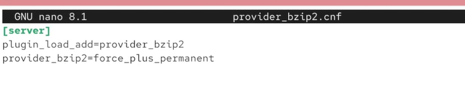{#fig:012}

Файл provider_snappy.cnf:  
секция server.  
plugin_load_add=provider_snappy подключает плагин сжатия Snappy.  
provider_snappy=force_plus_permanent — принудительная загрузка, запрет выгрузки (рис. [-@fig:013]).

{#fig:013}

Запустим службу mariadb, поставим её в автозагрузку и через ss убедимся, что она слушает порт 3306 (рис. [-@fig:014]).

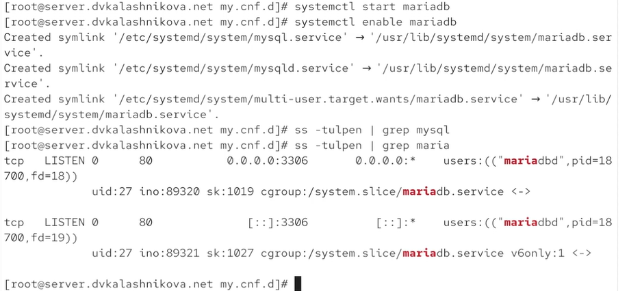{#fig:014}

Выполним mysql_secure_installation и настроим базу данных (рис. [-@fig:015]).

{#fig:015}

Подключимся к базе и выведем справку — всё работает (рис. [-@fig:016]).

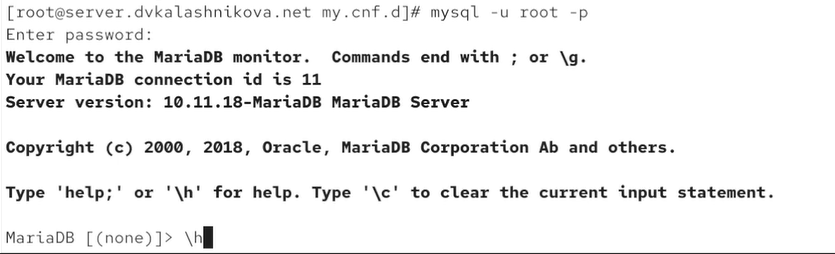{#fig:016}

Посмотрим список баз данных: на этом шаге их четыре (рис. [-@fig:017]).

{#fig:017}

Выведем статус БД и разберём его построчно:

**Информация о клиенте**  
mysql Ver 15.1 Distrib 10.11.18-MariaDB, for Linux (x86_64) using EditLine wrapper  
Строка описывает программу, через которую выполнено подключение: клиент mysql из дистрибутива MariaDB 10.11.18.

**Параметры текущего сеанса**  
Connection id: 12  
Уникальный идентификатор текущего подключения.  
Current database:  
Текущая выбранная база данных. Здесь она не выбрана.  
Current user: root@localhost  
Пользователь и хост, с которого выполнено подключение.  
SSL: Not in use  
Используется ли шифрование SSL/TLS в этом соединении — здесь нет.  
Current pager: stdout  
Утилита постраничного вывода; stdout означает вывод прямо в консоль.  
Using outfile: ''  
Перенаправляется ли вывод в файл — нет.  
Using delimiter: ;  
Символ завершения SQL-команд.

**Информация о сервере**  
Server: MariaDB  
Тип сервера.  
Server version: 10.11.18-MariaDB MariaDB Server  
Полная версия серверного ПО.  
Protocol version: 10  
Версия протокола обмена между клиентом и сервером.  
Connection: Localhost via UNIX socket  
Способ подключения: локальный, через UNIX-сокет — это эффективно.  
UNIX socket: /var/lib/mysql/mysql.sock  
Путь к файлу сокета для этого соединения.

**Кодировки**  
Server characterset: latin1  
Кодировка по умолчанию для всего сервера.  
Db characterset: latin1  
Кодировка по умолчанию для текущей базы.  
Client characterset: utf8mb3  
Кодировка, в которой клиент отправляет запросы.  
Conn. characterset: utf8mb3  
Кодировка текущего соединения.

**Статистика и время работы**  
Uptime: 8 min 2 sec  
Время работы сервера с момента последнего запуска.  
Threads: 1 Questions: 23 Slow queries: 0 Opens: 20 Open tables: 13 Queries per second avg: 0.047  
Краткая сводка производительности:  
одно активное подключение (поток);  
23 запроса с момента старта;  
0 медленных запросов;  
20 открытий файлов таблиц;  
13 открытых таблиц на текущий момент;  
0.047 — среднее число запросов в секунду (рис. [-@fig:018]).

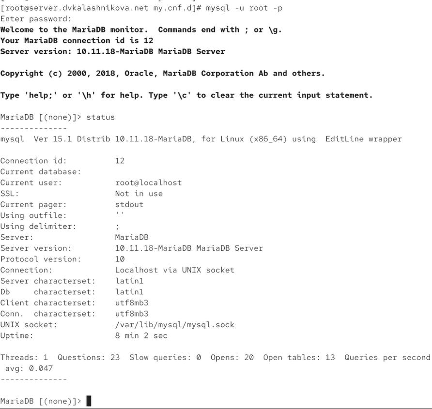{#fig:018}

Перейдём в /etc/my.cnf.d и создадим там файл utf8.cnf (рис. [-@fig:019]).

{#fig:019}

Запишем в него строки, задающие кодировку utf8 по умолчанию (рис. [-@fig:020]).

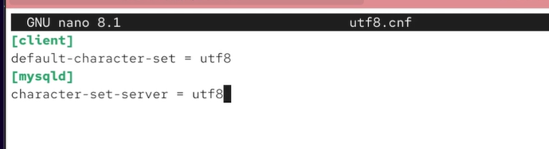{#fig:020}

Перезапустим mariadb, снова войдём в БД и снова посмотрим статус: кодировка поменялась с latin1 на utf8 (рис. [-@fig:021]).

{#fig:021}

Создадим базу addressbook, перейдём в неё и убедимся, что она пуста. Затем создадим в ней таблицу city и добавим три записи: Иванов, Петров, Сидоров. Выведем таблицу (рис. [-@fig:022]).

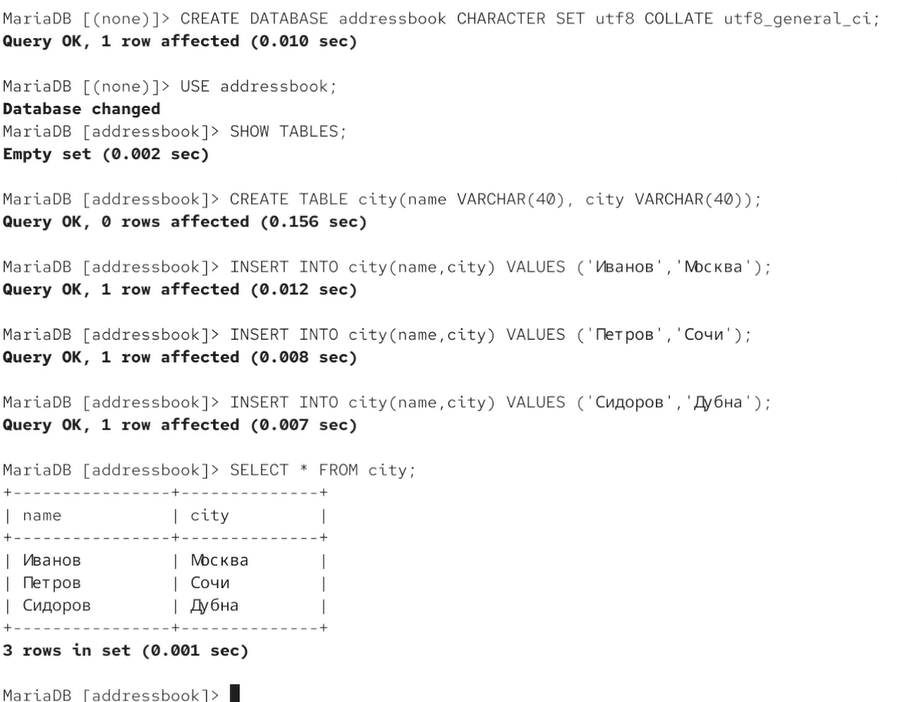{#fig:022}

Создадим пользователя dvkalashnikova и дадим ему доступ к этой таблице. Убедимся, что число баз выросло с 4 до 5. Затем попробуем показать базу addressbook от имени рута и от имени нового пользователя — обе операции проходят, значит, доступ у пользователя есть (рис. [-@fig:023]).

{#fig:023}

Попробуем сделать бэкапы и откатиться на них: создадим обычный, сжатый и с таймстемпом. Затем сохраним все конфиги в vagrant (рис. [-@fig:024]).

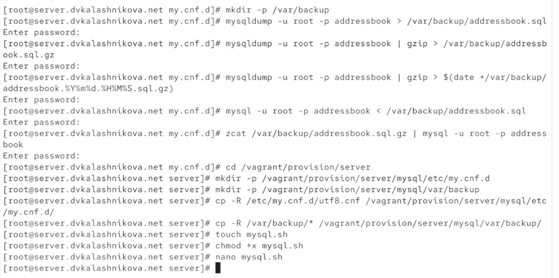{#fig:024}

В скрипте mysql.sh пропишем следующие строки (рис. [-@fig:025]).

{#fig:025}

А в vagrantfile добавим автозагрузку этого скрипта (рис. [-@fig:026]).

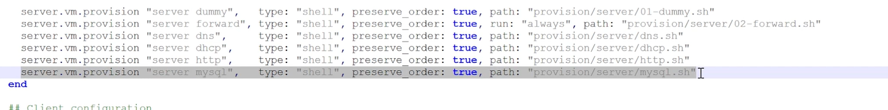{#fig:026}

# Выводы

В ходе лабораторной работы получены навыки работы с базами данных и их настройкой.

# Список литературы {.unnumbered}

1. MariaDB Foundation. MariaDB Documentation [Электронный ресурс]. — URL: https://mariadb.com/kb/en/documentation/ (дата обращения: 07.10.2026).

2. MariaDB Foundation. MariaDB Server Configuration Files [Электронный ресурс]. — URL: https://mariadb.com/kb/en/configuring-mariadb-with-option-files/ (дата обращения: 07.10.2026).

3. Red Hat. Documentation [Электронный ресурс]. — URL: https://docs.redhat.com/ (дата обращения: 07.10.2026).
